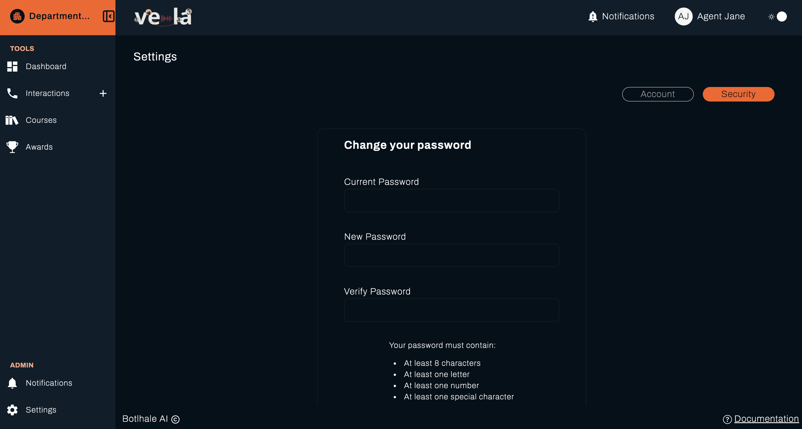
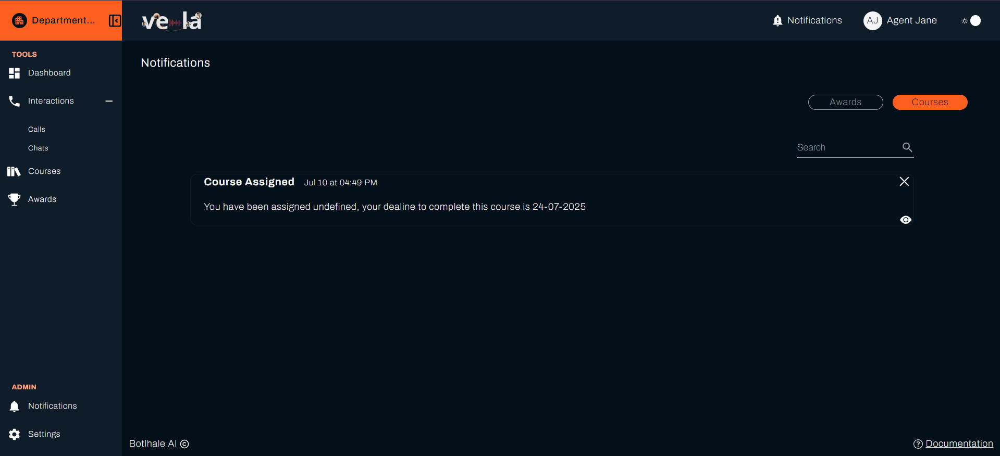
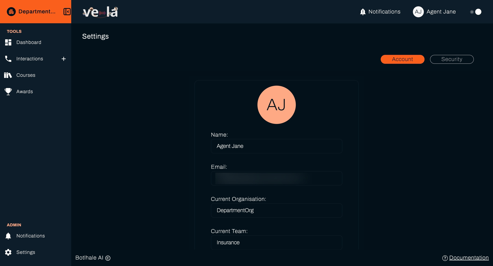

The Admin section serves as your account management center, including both communications and settings management. This area helps you stay connected with important updates and maintain control over your account security and preferences.

## Overview

The Admin section is divided into two main areas:

- **Notifications**: Your in-app communication center
- **Settings**: Account information and security management

---

## Notifications

The Notifications tab acts as your in-app communication center where you can view messages, updates, and alerts sent through the system. This ensures you never miss critical updates or important communications from your team.

## Settings

The Settings tab allows you to view and manage your account information, ensuring your account remains secure and up to date with current details.

### Account Information

View your basic account information:

- **Full Name**: Your full name
- **Email**: Your email address
- **Current Organisation**: Your assigned organiation
- **Current Team**: Your current assigned team

### Password Management

Keep your account secure with robust password controls:

**Change Password**

1. Enter your current password for verification
2. Create a new strong password following these requirements:
   - Minimum 8 characters
   - Include uppercase and lowercase letters
   - Include at least one number
   - Include at least one special character
3. Confirm your new password
4. Click **Save** to apply changes

**Password Security Tips**

- Use a unique password not used elsewhere
- Consider using a password manager
- Update your password regularly (every 90 days recommended)
- Never share your password with colleagues
- Log out from shared computers

> **Keep Your Account Secure**: Regularly review and update your account settings to maintain security and ensure you receive important communications. Contact your Team Lead or QAs support if you experience any issues with your account.
