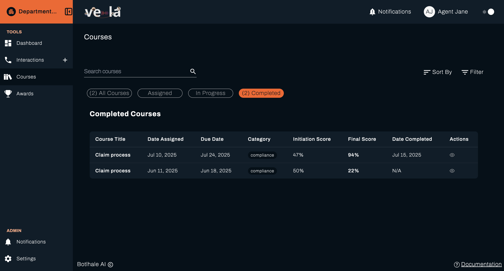
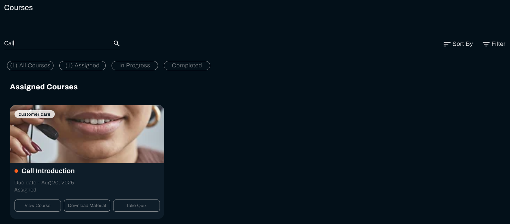
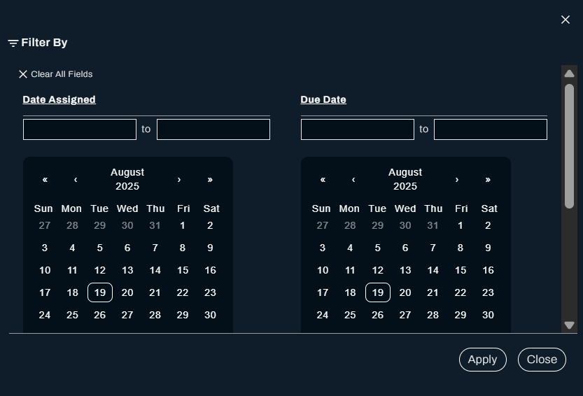
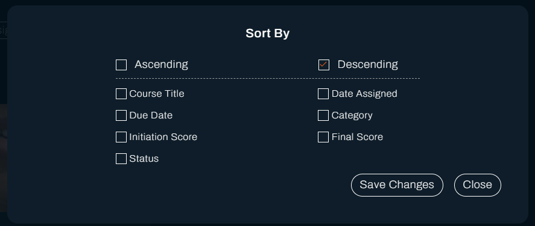
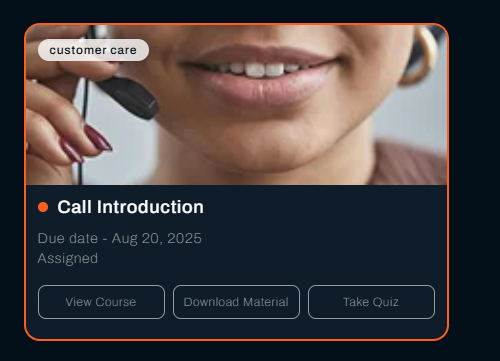
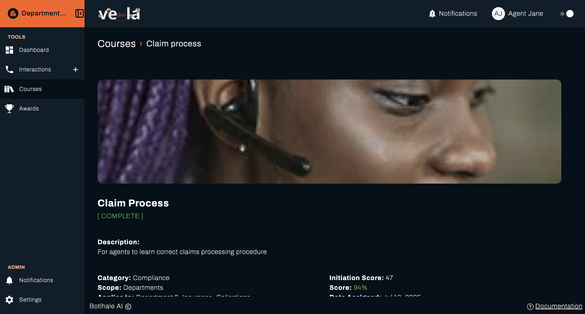
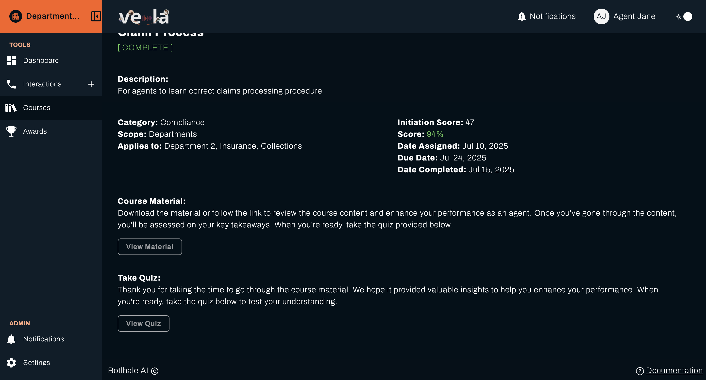
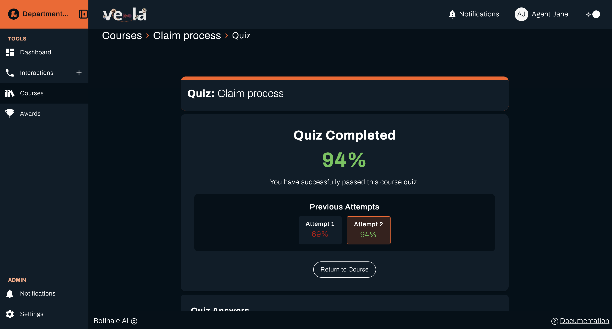
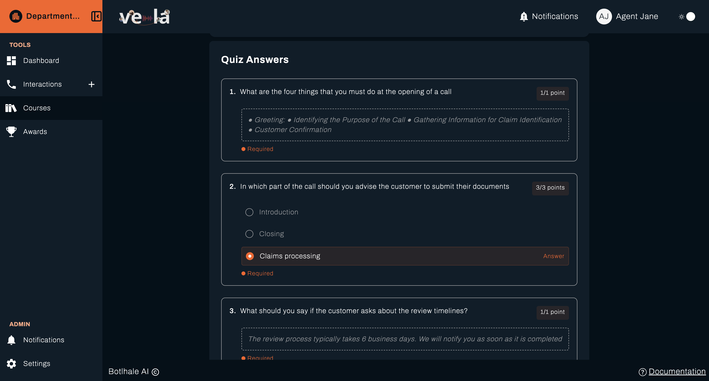

The Courses section is where you can manage and track your learning progress. All your assigned training materials, ongoing courses, and completed certifications are organised here for easy access and monitoring.

## Overview

Your courses are organised by status to help you prioritize your learning activities:

- **All Courses**: Complete view of every course available to you
- **Assigned**: New courses that have been assigned to you
- **In Progress**: Currently active courses you're working on
- **Completed**: Successfully finished courses with your results

## Course Table View

All completed courses are presented in a comprehensive table format that includes:

| Column               | Description                                      |
| -------------------- | ------------------------------------------------ |
| **Course Title**     | Name of the course or training module            |
| **Date Assigned**    | When the course was assigned to you              |
| **Due Date**         | Deadline for course completion                   |
| **Category**         | Course type (e.g., Customer Service, Compliance) |
| **Initiation Score** | Your baseline score before starting the course   |
| **Final Score**      | Your score after completing the course           |
| **Date Completed**   | When you successfully finished the course        |
| **Actions**          | Available actions for each course                |

This layout makes it easy to track where you are in your learning journey and how you've performed over time.

## Finding Your Courses

### Quick Search

Use the search bar at the top left of the Courses section to quickly find any course by name. Simply type the course title to locate specific course and its material.

### Filtering and Sorting Options

Filter your courses by:

- **Date Assigned**: See courses by date assigned
- **Due Date**: See courses by their deadlines
- **Category**: View courses by category

Sort your courses by ascending or descending order by:

- _Course Title, Due Date, Initiation Score, Status, Date Assigned, Category, Final Score_

## Course Actions

For each course in your list, you'll see action buttons that allow you to:

### View Course Details

Click **View Course Details** to open a detailed view of the course where you can:

- Review course objectives and learning outcomes
- Check your progress and completion status
- Access course materials and resources
- View quiz results and feedback

### Access Course Materials

#### PDF Materials

When course material is a PDF:

1. Click **View Material**
2. The file will download directly to your device
3. Open the downloaded PDF to access the content
4. Save the file for offline reference

#### Online Materials

When course content is web-based:

1. Click **View Material**
2. The course content opens in a new browser tab
3. Complete the material at your own pace
4. Return to the portal to take any required quizzes

### Take Course Quizzes

#### Starting a Quiz

1. Click **Take Quiz** when you're ready to be assessed
2. Review any pre-quiz instructions or requirements
3. Ensure you have adequate time to complete the assessment

#### Completing the Quiz

1. Answer all questions thoroughly
2. Review your responses before submitting
3. Click **Submit** to complete the quiz
4. View your immediate results and feedback

#### Quiz Results

After submission, you can:

- View the course details
- View or download the material

- To view the Quiz Results you would need to click on **View Quiz** button demonstrated below
  

#### Quiz Results

- View your score and percentage
- Review correct and incorrect answers
- Read detailed explanations for each question
- Identify areas for improvement
  

#### Quiz Results (continued)

View every question and the results in detail by scrolliing down.

---

> **Need Assistance?**
> If you have questions about your courses or need technical support, contact your Team Lead or QA.
