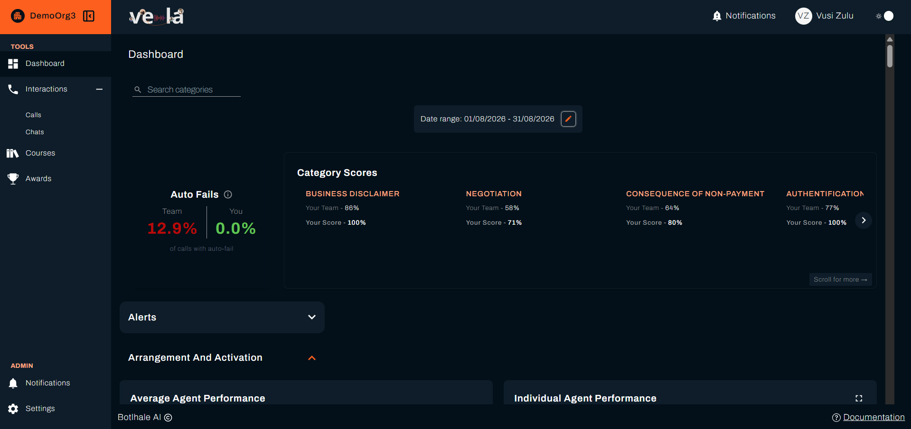
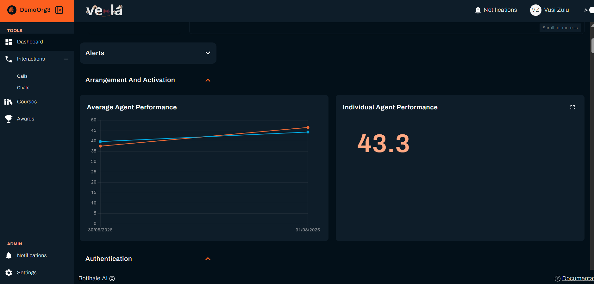

Your Agent Dashboard shows you everything about your learning and development at a glance. It's where you'll spot trends, identify improvement opportunities, and track your progress over time.

## What You Can Achieve

Your dashboard transforms your performance data into actionable insights. With it, you can:

| **Performance Monitoring** | **Self-Development** | **Goal Setting** |
|---------------------------|-------------------|----------------|
| **Track your learning progress** | **Identify areas for improvement** | **Set personal development goals** |
| **Compare with team performance** | **Monitor skill development** | **Celebrate achievements** |
| **Spot trends and patterns** | **Focus on growth opportunities** | **Plan your development path** |

---

## Understanding Your Dashboard

Your agent dashboard provides a comprehensive view of your individual performance metrics and the average agent performance in your team, department or organisation. Everything is designed to help you understand your current standing and identify areas for growth across the different categories.

---

## Dashboard Metrics Explained

### Category Scores

Track your individual score in multiple categories versus your team score. This assists in your ability to identify areas of improvement.

#### Auto Fails

- **Auto-Fails**: Auto Fails represent critical errors that automatically fail an evaluation. This percentage shows what portion of calls had at least one auto-fail criterion.

#### Performance Charts

View your performance trends over a specified date range. Use the **Date range** filter to zone in on specific dates you are interested in to analyse:

- Average Agent Performance trends
- Your Individual Agent Performance

---

## What's Next?

Now that you understand your dashboard, explore these related guides:

- **[Track Your Courses](./AgentCourses.md)** - Monitor your learning progress
- **[View Your Awards](./AgentAwards.md)** - Celebrate your achievements
- **[Review Your Interactions](./Interactions.md)** - Analyse your performance

---

## Need Help?

Stuck with your dashboard? We're here to help!

- **📖 [Course Tracking Guide](./AgentCourses.md)** - Learn about monitoring your learning progress
- **📖 [Awards Guide](./AgentAwards.md)** - Understand your recognition achievements
- **📖 [Interaction Analysis Guide](./Interactions.md)** - Review your performance insights

**Still need assistance?**
- **Email us**: support@botlhale.ai
- **Visit our support portal**: [support.botlhale.ai](https://support.botlhale.ai)

---

## Was This Guide Helpful?

We're constantly improving our documentation. Let us know how we can make this guide better for you and your team.
