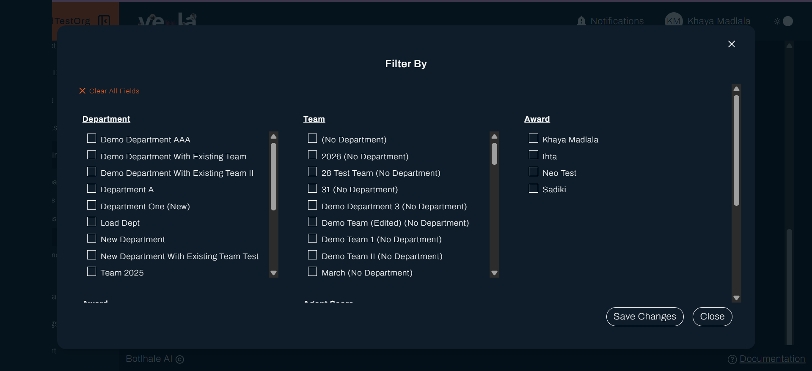
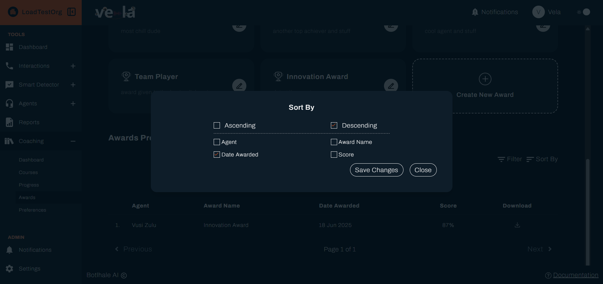
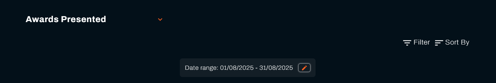
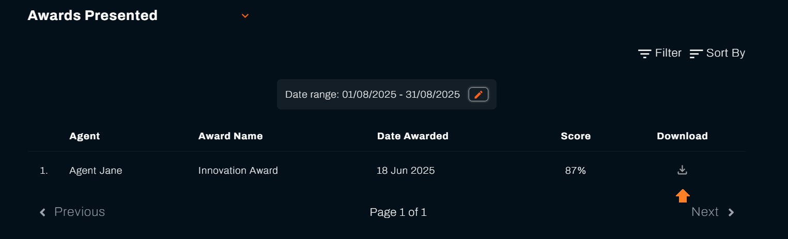
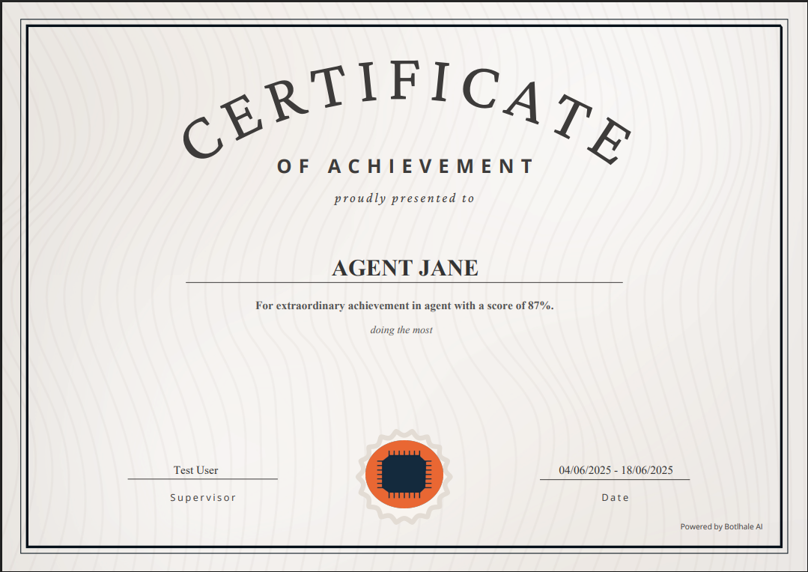

An award is recognition you define once and Vela presents automatically. You set what earns it, and on each evaluation cycle every agent who meets the criteria receives it with a certificate. Like courses, awards reach people by score rather than by name.

---

## Before You Begin

You need:

- **Something worth recognising.** An award for a mark most of the team already clears recognises nothing. Set it where reaching it means something.
- **To know your evaluation cycle.** Awards are presented on the cycle set under Preferences, so one created today reaches agents at the next run. See [Set Coaching Preferences](./Preferences.md).

---

## 1. Create an Award

Select **Coaching** in the left sidebar, then **Awards**. Select **Create Award** to open **Create a new award**.

| Field | What it does |
| :--- | :--- |
| **Award Name** | What the award is called, on the certificate and in the agent's list |
| **Award Description** | What the award recognises |
| **Award Message** | What the agent reads when it is presented to them |
| **Award Category** | Groups related awards |
| **Agent Score** | The score an agent reaches to earn it |

Write the **Award Message** as though speaking to the person. It is the part they actually read, and a specific sentence about what they did well is worth more than a generic congratulation.

Select **Create Award** to save.

---

## 2. See What Has Been Presented

**Awards Presented** lists what has gone out, with the agent and the **Date Awarded**.

**Filter**, **Sort**, and the date range control sit above the list.

---

## 3. Download a Certificate

Select **Download Award** on a row to save that agent's certificate. It carries their name, the award, and the date.

Agents can download their own certificates from their portal, so this is for your records rather than for sending to them. See [View Your Awards](./AgentAwards.md).

---

## 4. Edit an Award

Select **Edit Award** to change an award's details or the score that earns it.

Changing the score changes who qualifies from the next evaluation cycle on. Awards already presented stay presented.

---

## Check Your Work

The award appears in the list as soon as you save it. That confirms it exists, not that anyone has earned it.

To confirm it is being presented, open **Awards Presented** after the next evaluation cycle. Nothing there before the cycle runs is expected. An award nobody earns after several cycles usually means the **Agent Score** is set higher than the team reaches.

---

## Related

- [Read the Coaching Dashboard](./Dashboard.md): the scores awards are set against
- [Create and Assign Courses](./Courses.md): training that lifts agents towards them
- [Set Coaching Preferences](./Preferences.md): the cycle that presents awards
- [View Your Awards](./AgentAwards.md): what the agent sees when one arrives

## Need Help?

**Contact Support:** support@botlhale.ai
