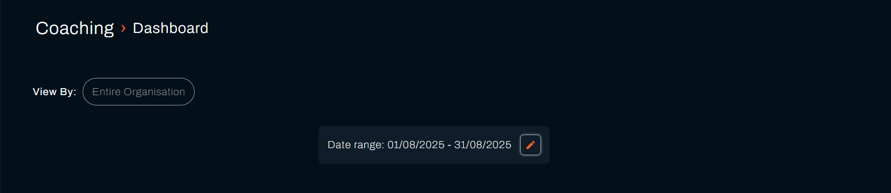
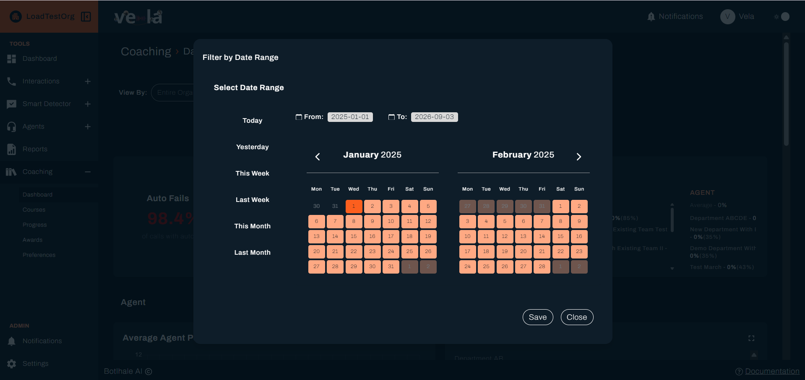

The Team Lead Dashboard provides a comprehensive overview of your team's performance metrics, allowing you to monitor progress, identify areas for improvement, and track trends over time. This powerful analytics tool gives you the insights needed to make data-driven decisions about team development and performance optimization.

## Overview

Your dashboard displays key performance indicators across multiple categories, helping you understand your team's current standing and make informed coaching decisions. The dashboard is designed to provide both high-level insights and detailed analytics to support your team management responsibilities.

## Dashboard Features

### Date Range Selection

Use the **Date Range** filter at the top of the dashboard to analyze performance over specific time periods with flexible options:

- **Custom Date Range**: Select specific start and end dates to focus on particular periods for detailed analysis
- **Quick Filters**: Choose from preset options like "Last 7 days", "Last month", "Last quarter" for common reporting periods
- **Real-time Updates**: All metrics automatically update when you change the date range, ensuring you always have current information

**Custom Date Range Filter (continued)**

**Date Range Best Practices:**
- **Short-term analysis (7-14 days)**: For detailed performance review and immediate intervention planning
- **Medium-term tracking (30-90 days)**: For trend identification and pattern recognition
- **Long-term planning (3-12 months)**: For strategic planning and goal setting
- **Comparative analysis**: Use different periods to identify seasonal patterns or improvement trends

### Category Scores

Your dashboard shows performance metrics across different evaluation categories that reflect your organization's specific quality standards and coaching priorities. The specific categories you see will depend on how your company has configured the system to align with business objectives.

Common categories include:

**Customer Care** – How well agents handle customer interactions and deliver exceptional service experiences

**Compliance** – Adherence to company policies, regulatory standards, and documentation accuracy:
- Policy compliance rates
- Regulatory requirement adherence
- Documentation completeness
- Audit readiness scores
- Risk management metrics

**Technical Skills** – Proficiency in using systems, tools, and technical knowledge:
- System navigation efficiency
- Technical problem-solving ability
- Tool utilization rates
- Knowledge application accuracy
- Process adherence scores

**Communication** – Effectiveness in verbal and written communication:
- Clarity and professionalism ratings
- Active listening demonstration
- Empathy and rapport building
- Language and grammar accuracy
- Tone and approach appropriateness

### Auto Fails

**Auto Fails** represent critical errors that automatically fail an evaluation and require immediate attention. This percentage shows what portion of calls had at least one auto-fail criterion, helping you identify serious performance issues that need urgent intervention.

#### Understanding Auto Fail Metrics

- **Percentage Display**: Shows the proportion of interactions with auto-fail occurrences relative to total interactions
- **Trend Tracking**: Monitor whether auto-fail rates are increasing, decreasing, or remaining stable over time
- **Team vs Individual**: Compare team average with individual agent performance to identify outliers

---

## Performance Charts

Access detailed performance analytics through expandable chart sections that provide deeper insights into team performance trends and patterns over time.

### Chart Sections

The dashboard includes several accordion-style chart sections that can be expanded for detailed analysis:

#### Average Agent Performance

**Left Panel**: Displays average agent performance on a category-by-category basis with trend lines and comparison data.

#### Overall Performance Analysis

**Right Panel**: Shows aggregate performance data based on your selected scope on a category basis with comprehensive analytics.

**Scope Options:**

- **Team Performance**: Metrics for your specific team with detailed breakdowns
  - Individual agent contributions to team metrics
  - Team dynamics and collaboration effectiveness
  - Internal performance variations and consistency
  - Team-specific challenges and opportunities

- **Department Performance**: Broader departmental view including multiple teams
  - Cross-team performance comparisons
  - Department-wide trends and patterns
  - Resource sharing and best practice identification
  - Departmental goal alignment and achievement

- **Agent Department**: Cross-departmental agent performance comparison
  - Performance benchmarking across departments
  - Skill transfer opportunities between teams
  - Organizational learning and knowledge sharing
  - Career development and advancement planning

### Interactive Features

#### Drill-Down Capabilities

- **Click on Data Points**: Access detailed breakdowns of specific metrics for deeper analysis
- **Zoom In or Resize**: Ability to resize charts to drill down and view data accurately

---

> **Maximize Team Success**: Regular dashboard monitoring combined with targeted coaching interventions leads to sustained performance improvements. Use the insights from this comprehensive dashboard to guide your team toward excellence while maintaining focus on both individual growth and team objectives. Remember that effective dashboard utilization requires consistent attention, thoughtful interpretation, and commitment to data-driven decision making.

---

*Last updated on Jul 29, 2025 by athenkosi-cetyana*
