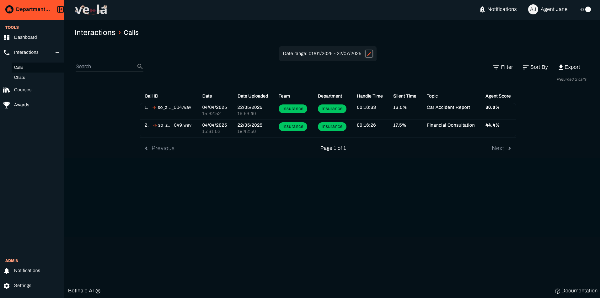
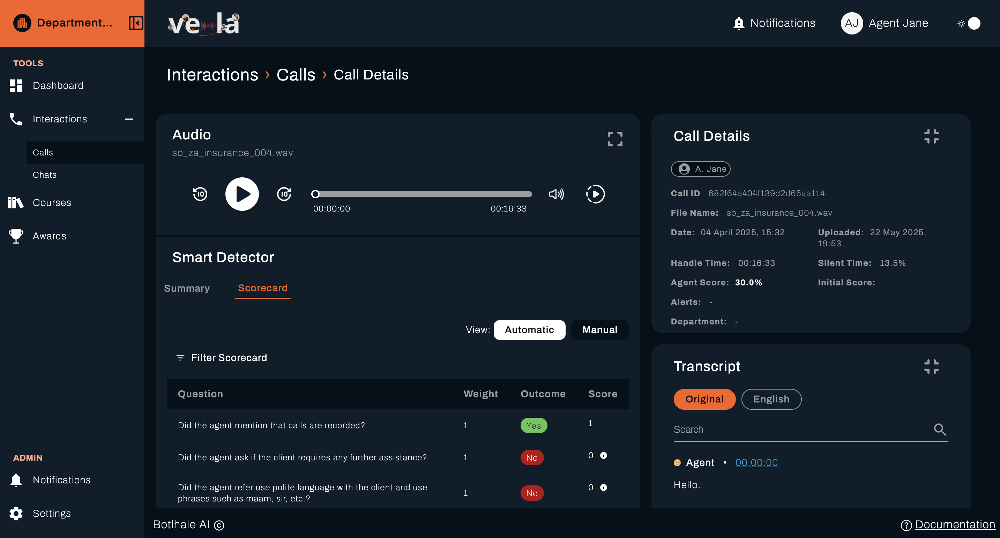
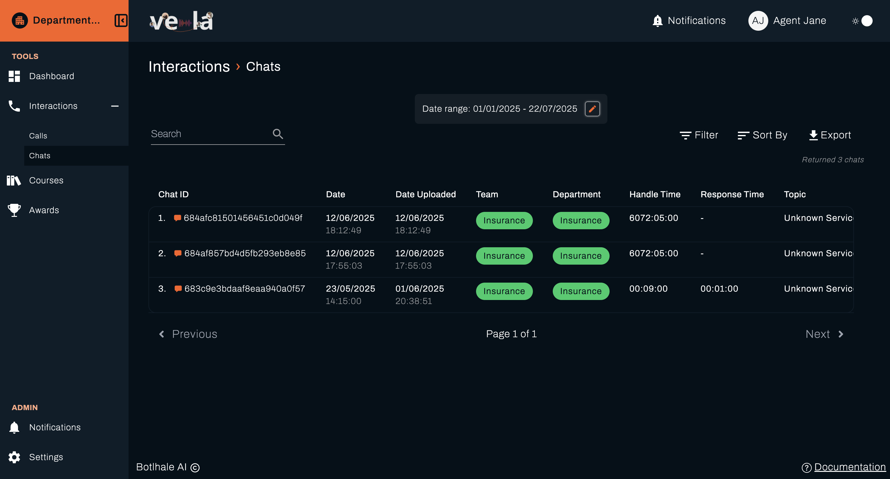
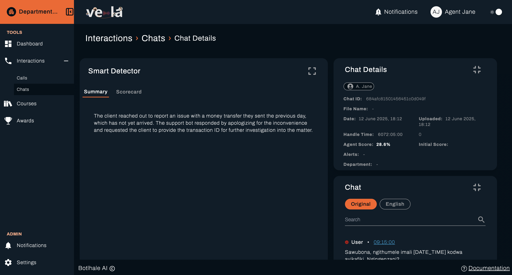
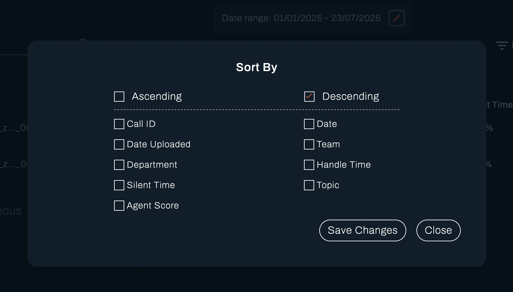
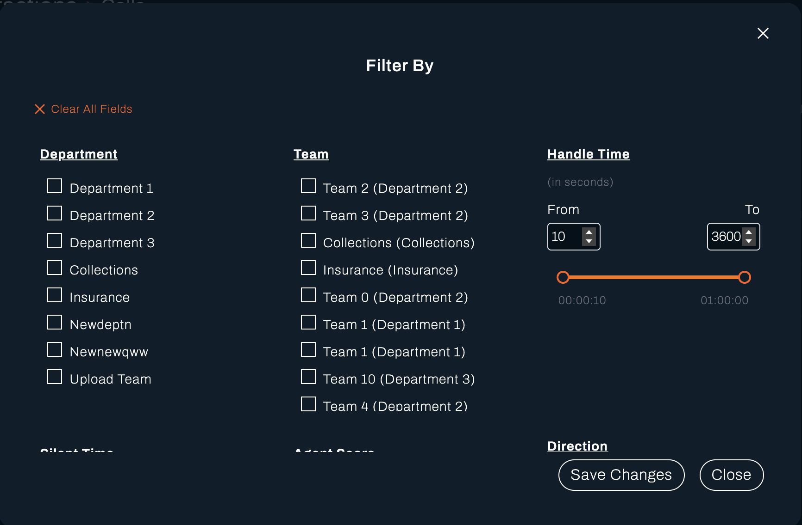
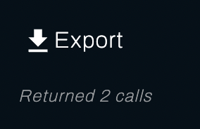

# Interactions - Agent View

As an agent, view and analyze your call recordings and chat interactions to understand your performance and identify areas for improvement.

## Overview

The Interactions section provides detailed insights into your customer communications across both voice calls and chat sessions. This helps you:

- Review conversation quality and customer satisfaction
- Identify patterns in customer inquiries
- Track your performance metrics over time
- Learn from successful interactions

---

## Calls

Monitor and analyze your voice call interactions with customers.

### Recent Calls Performance

View your most recent call interactions with key performance indicators:

### Call Analytics

#### Performance Metrics

Track your call performance with these key indicators:

- **Average Call Duration**: 11:43 minutes
- **Customer Satisfaction**: 4.5/5 average rating
- **First Call Resolution**: 87%
- **Quality Score**: 90% average
- **Silent Time**: 8.2% average

#### Common Call Topics

Understanding the topics you handle most frequently:

1. **Billing Inquiries** (35%) - Questions about charges, payments, and account balances
2. **Technical Support** (28%) - Product issues, troubleshooting, and setup assistance
3. **Account Management** (20%) - Profile updates, password resets, and preferences
4. **Product Information** (12%) - Features, pricing, and availability questions
5. **Complaints** (5%) - Service issues and escalation requests

#### Call Quality Insights

Review detailed feedback on your call handling:

- **Strengths**: Excellent active listening, clear communication, professional tone
- **Areas for Improvement**: Reduce hold times, improve first-call resolution
- **Coaching Recommendations**: Complete the "Advanced Troubleshooting" course

### Detailed Call View

Click on any call to access detailed analysis. The detailed view is shown below

- **Full Transcript**: Complete conversation text with timestamps
- **Sentiment Analysis**: Customer emotion tracking throughout the call
- **Topic Detection**: Automatically identified discussion points
- **Quality Scorecard**: Detailed evaluation against company standards
- **Customer Feedback**: Post-call survey responses (when available)

---

## Chats

Analyze your text-based customer interactions and support conversations.

### Recent Chats Performance

View your most recent chat interactions:

#### Performance Metrics

Monitor your chat support effectiveness:

- **Average Response Time**: 39 seconds
- **Average Resolution Time**: 23 minutes
- **Customer Satisfaction**: 4.6/5 average rating
- **Resolution Rate**: 96%
- **Concurrent Chat Capacity**: 3.2 average

#### Chat Efficiency Indicators

Track how effectively you handle multiple conversations:

- **Messages per Resolution**: 12.4 average
- **Escalation Rate**: 4%
- **Transfer Rate**: 2%
- **Follow-up Required**: 8%

#### Common Chat Topics

Most frequent chat conversation topics:

1. **Order Inquiries** (40%) - Status, tracking, and modification requests
2. **Product Support** (25%) - Usage questions and troubleshooting
3. **Account Issues** (18%) - Login problems and profile management
4. **Billing Questions** (12%) - Payment issues and invoice clarification
5. **General Information** (5%) - Hours, policies, and contact details

### Chat Quality Insights

Review feedback on your chat support performance:

- **Strengths**: Quick response times, clear explanations, helpful resources
- **Areas for Improvement**: Use more personalized greetings, proactive follow-up
- **Coaching Recommendations**: Review "Customer Engagement Best Practices" module

### Detailed Chat View

Click on any chat session to see:

- **Complete Chat Log**: Full conversation history with timestamps
- **Response Time Analysis**: Breakdown of your reply speeds
- **Customer Journey**: Path taken before initiating chat
- **Resolution Steps**: Actions taken to solve the customer's issue
- **Satisfaction Survey**: Post-chat customer feedback

---

## Sort

## Filter

## Export

