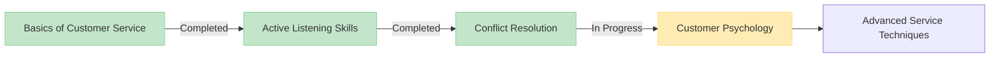
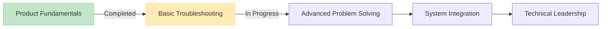

# Progress Tracking - Agent View

As an agent, track your development journey, monitor skill acquisition, and celebrate achievements as you advance through your personalized learning path.

## Your Personal Learning Dashboard

Your Progress dashboard provides a comprehensive overview of your individual learning journey, displaying:

- **Course Completion Rates**: Visual indicators showing percentage of your completed courses
- **Skill Development**: Charts mapping your progress in different skill areas
- **Achievement Badges**: Recognition of your milestones and accomplishments
- **Learning Streaks**: Tracking of your consecutive days of learning activity

![Progress Dashboard]

> **Agent Note**: This dashboard shows your personal performance metrics. Your team lead can view team-wide analytics through their separate dashboard.

## My Skill Development Metrics

### Current Skill Levels

Your current proficiency across core competency areas is displayed in an easy-to-read radar chart. Areas include:

| Skill Area           | Current Level | Target Level | Progress |
| -------------------- | ------------- | ------------ | -------- |
| Customer Interaction | Advanced      | Expert       | 75%      |
| Product Knowledge    | Intermediate  | Advanced     | 60%      |
| Problem Resolution   | Advanced      | Expert       | 80%      |
| Technical Skills     | Basic         | Intermediate | 40%      |
| Communication        | Advanced      | Expert       | 85%      |

### My Skill Growth Over Time

Track your personal progress over weeks and months with detailed growth charts that show:

- Month-by-month skill development
- Areas of accelerated growth
- Recommended focus areas based on your performance

## My Achievement Badges

Celebrate your personal accomplishments with achievement badges that mark important milestones in your learning journey.

### Recently Earned

  

    
    Quick Learner
    
Completed 5 courses in your first month

  

  
  

    
    Persistence
    
Maintained a 14-day learning streak

  

  
  

    
    Problem Solver
    
Successfully completed advanced troubleshooting scenarios

  

### Available Badges

Explore badges you can earn through continued learning and practice:

- **Knowledge Master**: Complete all courses in a learning path
- **Team Player**: Participate in 5 group learning sessions
- **Feedback Champion**: Provide constructive feedback on 10 courses
- **Consistent Performer**: Maintain an 80%+ score across all assessments
- **Innovation Pioneer**: Submit 3 improvement suggestions that get implemented

## My Learning Paths Progress

Monitor your advancement through structured learning paths designed to build expertise in specific domains.

### Customer Service Excellence Path

### Technical Knowledge Path

## My Performance Assessments

Regular assessments help gauge your knowledge retention and application skills.

### Recent Assessment Scores

| Assessment                      | Score | Team Average | My Percentile |
| ------------------------------- | ----- | ------------ | ------------- |
| Customer Interaction Simulation | 92%   | 78%          | 95th          |
| Product Knowledge Test          | 85%   | 80%          | 70th          |
| Troubleshooting Scenario        | 88%   | 75%          | 85th          |
| Communication Assessment        | 95%   | 82%          | 98th          |

### My Improvement Areas

Based on your assessment results, we recommend focusing on:

1. **Technical knowledge expansion** - Complete the Advanced Troubleshooting module
2. **Objection handling techniques** - Review customer psychology materials
3. **Time management skills** - Take the optional efficiency workshop

## My Goal Setting

Set personal learning goals to stay motivated and focused on continuous improvement.

### Current Goals

- Complete Customer Psychology module by June 15
- Achieve Advanced certification in Product Knowledge by Q3
- Improve average assessment scores to 90%+ by year-end
- Earn the Knowledge Master badge in Customer Service path

### Setting New Goals

1. Click the "Add Goal" button in your Progress dashboard
2. Select a goal type: Course Completion, Skill Development, or Certification
3. Define your target achievement level and deadline
4. Add optional milestones to track progress

## Coaching Feedback

Your progress data is shared with your coach to facilitate targeted guidance and personalized feedback.

### Recent Coaching Notes

> "Great progress on customer interaction skills. Consider focusing more on technical knowledge to achieve a more balanced skill profile. Your active listening improvements are particularly notable."
>
> — Coach Michael, May 2023

### Request Feedback

Use the "Request Feedback" button to ask for specific guidance from your coach on:

- Recent assessment results
- Skill development priorities
- Career advancement strategies

## My Progress Reports

Generate comprehensive progress reports to share with managers or include in performance reviews.

1. Navigate to the Export section of your Progress dashboard
2. Select the date range and data points to include
3. Choose PDF or Excel format
4. Download or share your personalized report

## My Interactions History

### Recent Calls Performance

| Date       | Duration | Customer Satisfaction | Quality Score | Key Topics                 |
| ---------- | -------- | --------------------- | ------------- | -------------------------- |
| 2023-05-15 | 12:34    | 4.5/5                 | 92%           | Billing, Technical Support |
| 2023-05-14 | 8:45     | 4.8/5                 | 95%           | Product Information        |
| 2023-05-13 | 15:22    | 4.2/5                 | 88%           | Complaint Resolution       |

### Recent Chats Performance

| Date       | Duration | Customer Satisfaction | Response Time | Resolution Rate |
| ---------- | -------- | --------------------- | ------------- | --------------- |
| 2023-05-15 | 25:30    | 4.6/5                 | 45s           | 100%            |
| 2023-05-14 | 18:15    | 4.9/5                 | 32s           | 100%            |
| 2023-05-13 | 32:45    | 4.3/5                 | 52s           | 95%             |

## Data Privacy

Your progress data is private by default. You can control what information is shared with:

- Your assigned coach (default: full access)
- Team managers (default: summary statistics only)
- Learning community (default: badges and achievements only)

Adjust your privacy settings in the Account section.

---

> **Team Lead Features**: If you're a team lead looking to manage team progress and create courses, please access the Team Lead portal through the main navigation.
