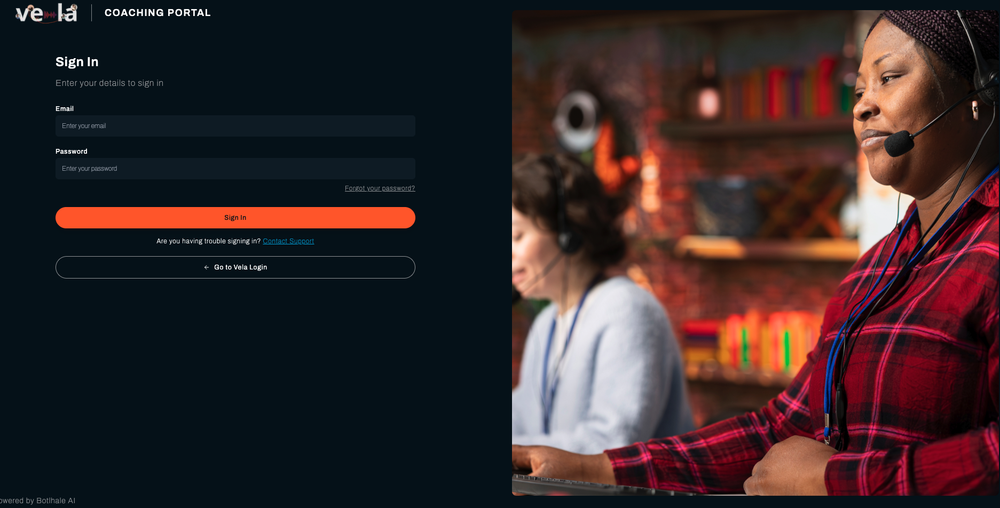
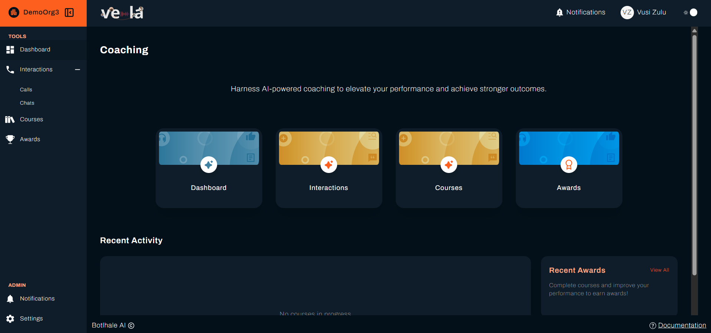

The Agent Portal is where you see how your conversations scored, work through training assigned to you, and read your team lead's feedback. It is separate from the main Vela platform your team lead uses, and it shows your own work only.

This page takes you through signing in for the first time and finding each part of the portal. It takes about ten minutes.

---

## Before You Begin

You need:

- **An invitation email.** Your team lead creates your account, and the portal emails you an invitation with a temporary password.
- **A current browser.** Chrome, Edge, Firefox, or Safari.

---

## 1. Sign In for the First Time

1. Open the invitation email and select **Confirm Account**. Do this before anything else, because the portal refuses the sign-in until your address is confirmed.
2. On the sign-in page, enter your email address and the temporary password from the email.

{/* UNVERIFIED: the "Confirm Account" button label is not in the vela or vela-data source, because it lives in an email template neither repository holds. The verification flow itself is confirmed at app/api/auth/[...nextauth]/route.js:44. The label matches docs-vela and the onboarding video script, both written by people who have seen the email. Confirm against a real invitation when one is to hand. */}
3. Select **Sign In**.

Signing in takes you straight to your **Dashboard**.

:::note Signing in with Google or Microsoft
Where your organisation uses Single Sign-On, use **Sign in with Google** or **Sign in with Microsoft** instead. You do not set a portal password, and the **security** tab does not appear.
:::

Change the temporary password once you are in. See [Manage Your Account](./your-account.md).

---

## 2. Find Your Way Around

The left sidebar holds everything, in two groups.

**TOOLS** is your day-to-day work:

| Item | What it holds |
| :--- | :--- |
| **Dashboard** | Your scores over a period you choose |
| **Interactions** | Your calls and chats, with transcripts and comments |
| **Courses** | Training assigned to you |
| **Awards** | Recognition you have been presented |

{/* RESHOOT: this capture shows a fifth TOOLS item, Cautions, that the table above doesn't list. Cautions is unreleased (absent from vela's origin/main; issue-cautions.md is still draft). Reshoot from an account without the feature flag once Cautions ships and this page is updated to cover it, or once this capture is next redone. */}

**ADMIN** is your account:

| Item | What it holds |
| :--- | :--- |
| **Notifications** | New awards, courses, and comments |
| **Settings** | Your account details and password |

---

## 3. Take the Tour

Work through these in order. Each one shows you a different part of the portal.

1. **Open your Dashboard.** Set the date range to a period you have been working, and read **Category Scores**. The gap between **Your Team** and **Your Score** in each category is the most useful thing on the page. See [Monitor Your Performance](./personal-performance.md).

2. **Open one of your interactions.** Select **Interactions**, then **Calls** or **Chats**, and open one. Read the transcript alongside the **Scorecard** tab to see how the conversation was scored. See [Review Your Interactions](./your-interactions.md).

3. **Check for coaching comments.** On the same interaction, select **View Comments**. This is where your team lead's feedback appears, and where you reply. See [Review Your Interactions](./your-interactions.md).

4. **Look at your courses.** Select **Courses**. Anything under **Assigned Courses** is waiting for you, and each shows a **Due Date**. See [Track Your Courses](./your-courses.md).

5. **Check your notifications.** Select **Notifications** under **ADMIN**. The three tabs sort what has arrived into awards, courses, and comments.

---

## Check Your Work

You are finished when you have signed in with your own password, opened one interaction and read its transcript, and found where comments and notifications appear.

An empty Dashboard or interactions list is not a fault. It means nothing of yours has finished processing yet, or your organisation shows agents reviewed interactions only and nobody has reviewed one yet.

---

## Related

- [Monitor Your Performance](./personal-performance.md): read your scores and spot trends
- [Review Your Interactions](./your-interactions.md): transcripts, scorecards, and comments
- [Track Your Courses](./your-courses.md): work through assigned training
- [Manage Your Account](./your-account.md): notifications, account details, and your password

## Need Help?

**Contact Support:** support@botlhale.ai
