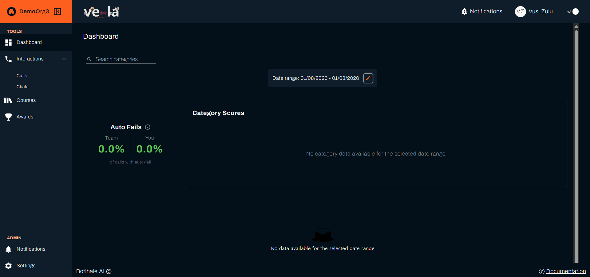

Your **Dashboard** is the first thing you see when you sign in to the Agent Portal. It shows how your interactions have scored over a period you choose, and how your figures compare with your team's.

---

## Before You Begin

You need:

- **Processed interactions in the period you are looking at.** The Dashboard is built from analysed calls and chats, so a period with none reads **No data available for the selected date range** rather than showing an error.
- **A scorecard set up by your organisation.** Scores come from the questions your organisation evaluates against. Without those, your interactions are transcribed but carry no score.

---

## 1. Set the Period

{/* SCREENSHOT NEEDED: the date range control itself, open. The capture in this step is a full page overview, so the control the step is about is not clearly shown. Suggested path: img/screenshots/agent_view/dashboard/date-range.png */}

Select the date range control at the top of the page to choose the period. Everything below it is recalculated for the dates you pick.

Start with a period long enough to hold several interactions. A single day rarely says much about a trend.

Use the **Search categories** box at the top left to show one category at a time in Category Scores.

---

## 2. Read Your Figures

The page holds four panels, most of which compare you with your team, which is what makes the figures mean something.

| Panel | What it shows | Read it for |
| :--- | :--- | :--- |
| **Auto Fails** | The share of your calls that failed a critical question, beside the same figure for your team | Whether one requirement is costing you whole interactions |
| **Category Scores** | Your score per category, beside your team's | Which specific area to work on |
| **Average Agent Performance** | The trend across the period | Direction, rather than any single day |
| **Individual Agent Performance** | Your own figure on its own | Where you stand right now |

The last two appear once for each category, further down the page, rather than once for the whole Dashboard. Select a category's name to open or close its section.

### A. Auto Fails

**Auto Fails** shows the proportion of your calls that failed a question your organisation marks as critical, next to the same figure for your team.

An [auto-fail](../reference/glossary.md#auto-fail) takes the whole interaction to zero whatever else went well, so this is the panel to look at first. A figure above your team's is worth a conversation with your team lead about which question is failing.

### B. Category Scores

**Category Scores** breaks your score down by the categories your organisation groups its questions into, such as Customer Care or Compliance.

Each category shows two figures: **Your Team** and **Your Score**. The gap between them is the useful part, because it separates a category you find hard from one the whole team finds hard.

When there are more categories than fit across the panel, an arrow on each side moves through them, and **Scroll for more** shows at the bottom. When no interactions fall in the date range, the panel reads **No category data available for the selected date range**.

### C. Performance Charts

Below the panels, each category your organisation scores on has its own section, headed with the category name. Select the heading to open or close it. Inside, **Average Agent Performance** shows the category's trend across the date range as a line, and **Individual Agent Performance** shows your current score for that category as a single figure. Select **fullscreen** on **Individual Agent Performance** to see that chart on its own.

Read the trend rather than any single point. One low interaction in a week of good ones is normal variation. Three in a row in the same category is a pattern.

:::tip Use the categories to choose what to work on
An overall score tells you where you stand. The category breakdown tells you what to do about it. Take the category with the widest gap below your team and look at a few interactions in it. See [Review Your Interactions](./your-interactions.md).
:::

---

## Check Your Work

Set the date range to a period you know holds interactions, and confirm the panels fill with figures.

When no interactions fall inside the dates you chose, the Category Scores panel reads **No category data available for the selected date range** and the bottom of the page reads **No data available for the selected date range**. Widen the range. If it stays empty across a long period, your interactions may not have finished processing yet.

---

## Related

- [Review Your Interactions](./your-interactions.md): open the conversations behind these figures
- [Track Your Courses](./your-courses.md): the training assigned when a score qualifies you for it
- [View Your Awards](./your-awards.md): recognition for the work these figures reflect

## Need Help?

**Contact Support:** support@botlhale.ai
