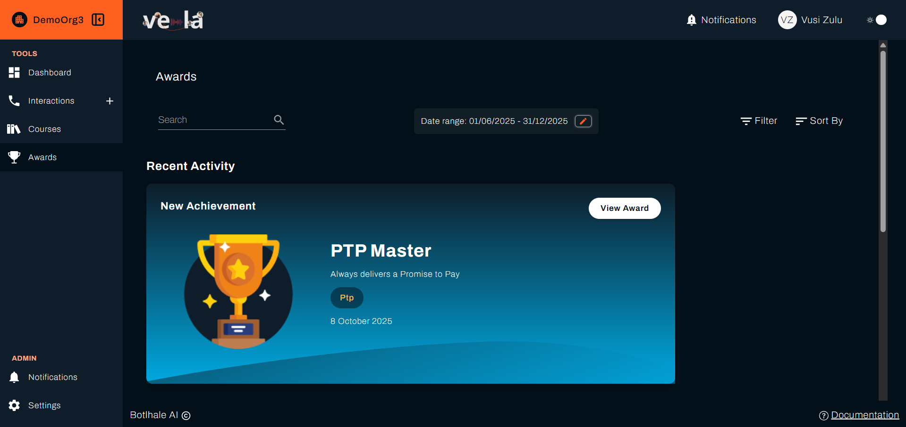
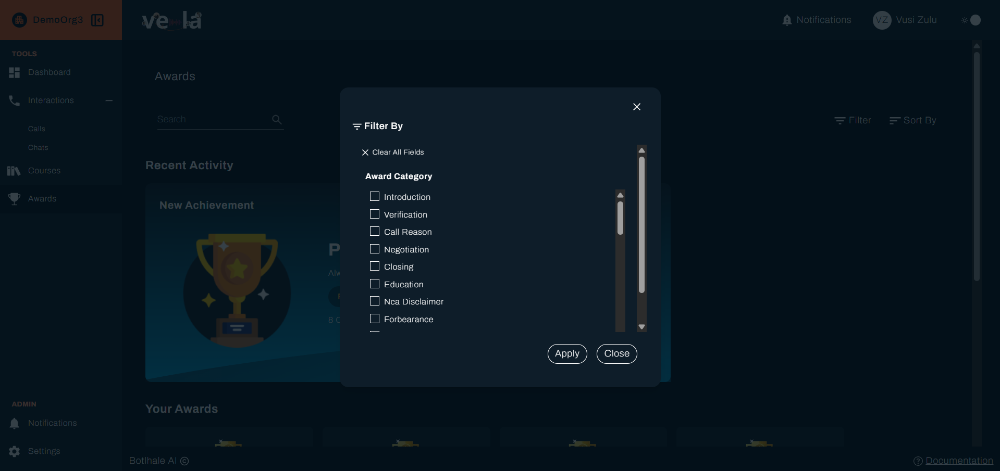
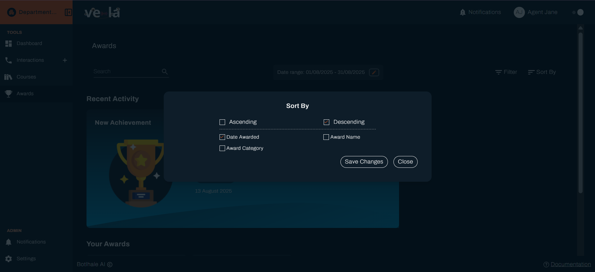
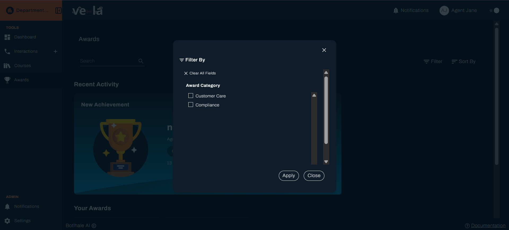
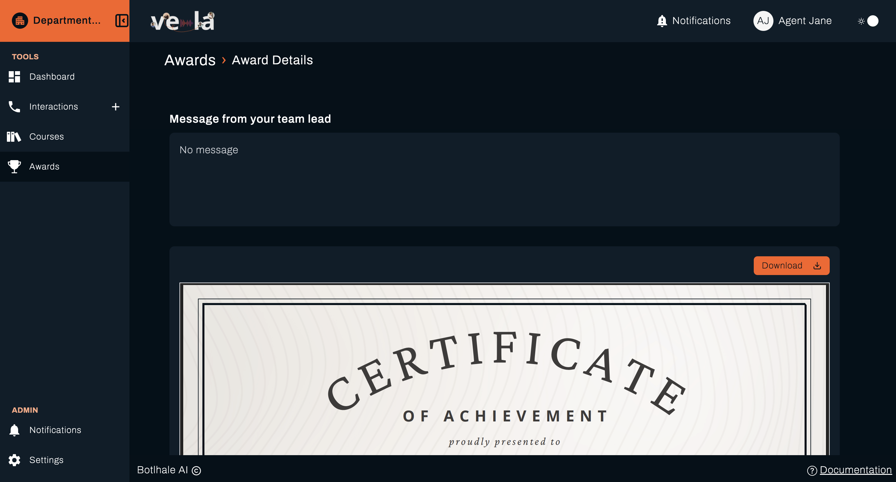
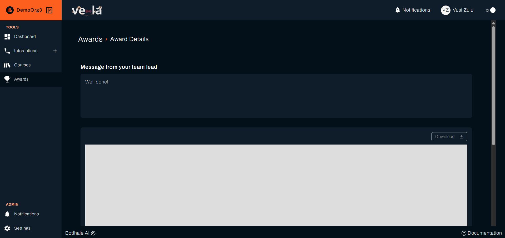
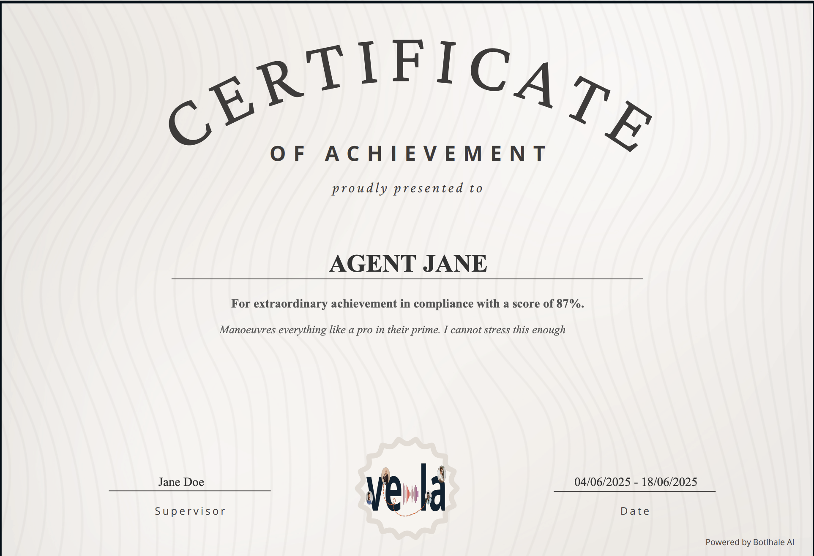

**Awards** in the left sidebar holds the recognition your organisation has presented to you. An award arrives when your scores meet the criteria your team lead set for it, so it reflects your figures rather than anyone's opinion on the day.

---

## Before You Begin

You need:

- **An award presented to you.** Until one is, the page is empty. That is a result rather than a fault.
- **Nothing else.** Awards arrive on their own. There is no action to take to receive one.

---

## 1. Find Your Awards

Select **Awards** in the left sidebar. Each award shows its name and the date it was awarded.

Four controls sit above the list:

| Control | What it does |
| :--- | :--- |
| **Search** | Narrows the list by wording in the award's name or description |
| **Filter** | Narrows the list by **Award Category** |
| **Sort By** | Orders the list by date awarded, award name, or award category |
| The date range | Narrows the list to a period |

---

## 2. Open an Award

Select an award to open **Award Details**.

The page holds what your team lead set when they created the award:

| Section | What it holds |
| :--- | :--- |
| **Message from your team lead** | What they wrote when presenting it to you |
| **Download** | Saves the certificate, above its preview |

{/* RESHOOT: same Cautions-in-sidebar issue as agent_sidebar.png in getting-started.md — see the note there. */}

---

## 3. Download the Certificate

Select **Download** to save the certificate. It carries your name, the award's category and score, its description, your team lead's name as the supervisor who presented it, and the period it was assessed over, rather than the award's own name or a single date. It is yours to keep or share.

:::note Awards follow your scores
Your team lead sets the criteria and Vela presents the award automatically when an agent meets them on the [evaluation cycle](../reference/glossary.md#evaluation-cycle), the same way courses are assigned. Nobody presents them manually.
:::

{/* UNVERIFIED: no code in vela or vela-data creates a PresentedAward record anywhere, the same gap that exists for course assignment (confirmed only by the product owner's own recollection, not by source). The Preferences page's own copy describes one Evaluation Cycle process covering "awards and training courses" with no distinction, which is why this note treats them the same. */}

---

## Check Your Work

Open **Awards** and confirm the award appears with the date you expect, and that **Download** produces a certificate with your name on it.

An award you were told about but cannot see may have been presented outside the period your date range covers. Widen it before asking.

---

## Related

- [Monitor Your Performance](./personal-performance.md): the scores awards are based on
- [Track Your Courses](./your-courses.md): training that lifts the scores behind them
- [Manage Your Account](./your-account.md): where award notifications arrive

## Need Help?

**Contact Support:** support@botlhale.ai
