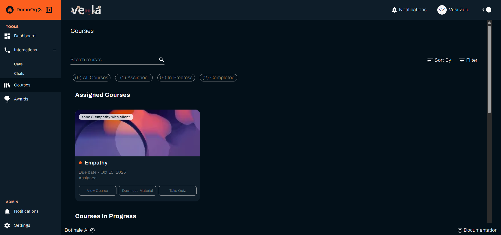
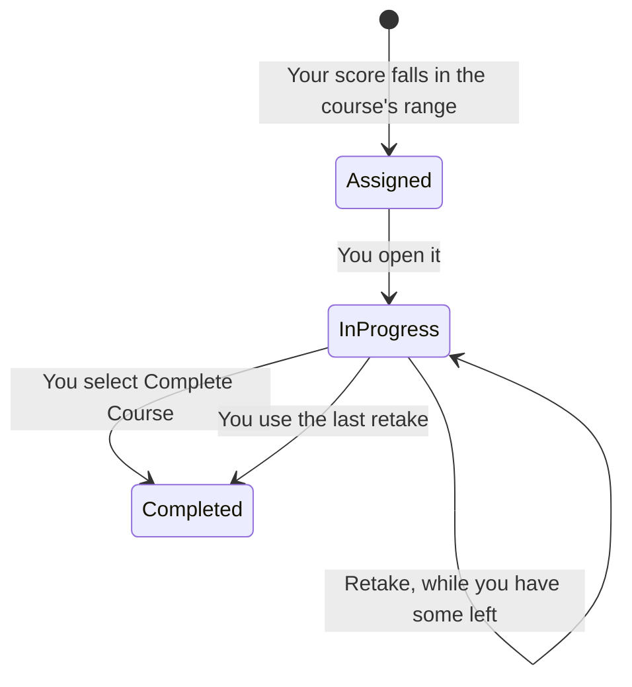

**Courses** in the left sidebar holds the training assigned to you. Vela assigns courses on your organisation's [evaluation cycle](../reference/glossary.md#evaluation-cycle), based on how you have scored, so a course arrives because your figures qualified you for it rather than because someone picked you.

---

## Before You Begin

You need:

- **A course assigned to you.** Your team lead creates courses and sets a [**Training Initiation Score Range**](../reference/glossary.md#training-initiation-score-range) on each course. Until your scores fall in a range, the list is empty.
- **To know your organisation's pass percentage.** Your team lead sets one for every course, so it is the same whichever course you take.

---

## 1. Find Your Courses

Select **Courses** in the left sidebar. The page groups what you have by where you are with it:

| Group | What it holds |
| :--- | :--- |
| **Assigned Courses** | Assigned to you, not started |
| **Courses In Progress** | Opened and part-way through |
| **Completed Courses** | Finished, with your result |

**Search**, **Sort**, and **Filter** sit above the list for when you have more than a screenful.

Each course shows its **Due Date**. Start early enough to finish before it.

---

## 2. Work Through the Material

Select **View Course** to open one. **Course Details** describes what it covers, and the material sits below.

{/* Two independent captures (quick-search.png above and course-actions.png below) both show View Course on an Assigned-status card, not Start Course. AgentCourseView.jsx ties Start Course to status === "assigned", but the live product no longer matches that — updated this step to what the screen actually shows. */}

Material comes in two forms, and a course may hold both:

- **Course Material** is a PDF your team lead uploaded. Select **Download Material** to read it.
- **Course Link** is an **External Link** that opens elsewhere in a new tab.

Read the material before starting the quiz. The quiz is scored, and your result is recorded against the course.

---

## 3. Take the Quiz

Select **Take Quiz** on a course that has one. Questions come in three forms:

| Type | What you do |
| :--- | :--- |
| **Multiple Choice** | Pick one of the options |
| **Short Paragraph** | Write a brief answer |
| **Long Paragraph** | Write a longer answer |

Written answers are still compared against an answer your team lead set when building the quiz, with Vela judging meaning rather than requiring exact wording. It records a short reason for the score, for your team lead's own review. Answer the question that was asked rather than writing generally around it.

Your result appears as a **Final Score**. **Initiation Score** sits beside it, showing the score you had when the course was assigned to you rather than a quiz result, so the gap between the two is what the course changed. Where you scored below the pass percentage, the page tells you so directly: *You did not meet the passing score of 70%*, with your organisation's figure in place of the 70.

Select **Review Quiz** to read back an attempt you have already submitted.

{/* UNVERIFIED: a live capture of Completed Courses shows that group as a table (Course Title, Date Assigned, Due Date, Category, Initiation Score, Final Score, Date Completed, Actions) with an eye icon in Actions, not a card with a Review Quiz button. Whether that icon is what this step means by "Review Quiz," or the wording has drifted, needs a live check. */}

### How Many Attempts You Get

A course reaches **Completed Courses** two ways, and they look the same in the list:

The **Final Score** beside the course is what tells the two apart.

{/* SCREENSHOT NEEDED: the quiz page showing the retakes remaining counter, and ideally a second capture of the result screen with the "You did not meet the passing score of N%" message. Neither is captured, and retakes are the thing agents ask about most. Suggested paths: img/screenshots/agent_view/courses/quiz-retakes-remaining.png and quiz-failed-result.png */}

Your team lead sets **Quiz Retakes** on each course, between 1 and 5, so the number is not the same on every course. The quiz page shows how many you have left.

The count is shown wherever you can act on it: the quiz page reads **You have 2 retakes remaining**, and the button itself is labelled **Retake Quiz (2 left)**. When they are gone it reads **You have no retakes remaining**.

:::warning Running out of retakes closes the course
The course moves to **Completed Courses** with the last score you got, whether or not you passed, and you cannot take it again. Check the number on the button before you start an attempt.
:::

A low first attempt is worth spending a retake on rather than leaving. Read the material again before you use the next one.

While retakes remain, the results screen also offers **Complete Course**, beside **Retake Quiz**. Selecting it closes the course out on that attempt's score, pass or fail, without waiting for retakes to run out. Passing does not move a course to **Completed Courses** by itself, so select **Complete Course** once you are satisfied with a result rather than assuming a pass alone is enough.

---

## Check Your Work

Open **Courses** and confirm the course you finished sits under **Completed Courses** with a **Final Score** on it.

A course still under **Courses In Progress** after you submitted usually means the quiz was not submitted rather than not passed. Open it and check. A course that moved to **Completed Courses** with a score below the pass percentage means your retakes ran out.

---

## Related

- [Monitor Your Performance](./personal-performance.md): the scores that decide which courses reach you
- [View Your Awards](./your-awards.md): recognition for the work you put in
- [Review Your Interactions](./your-interactions.md): the conversations behind your scores

## Need Help?

**Contact Support:** support@botlhale.ai
