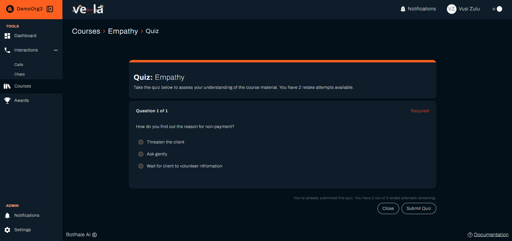
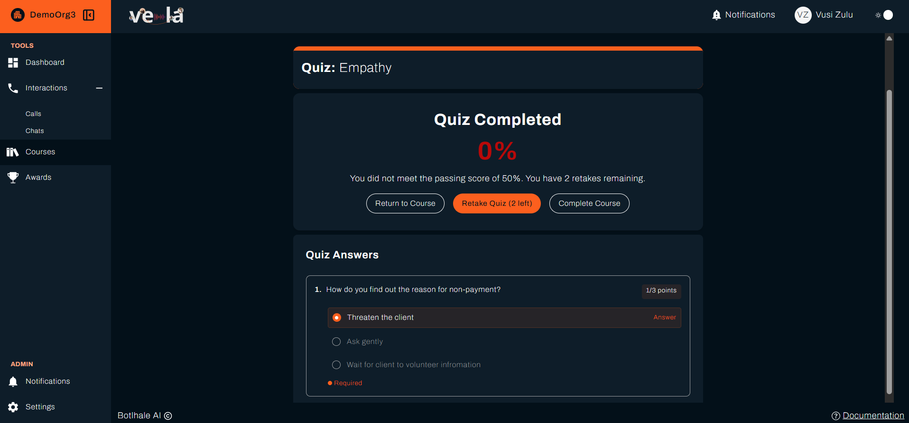
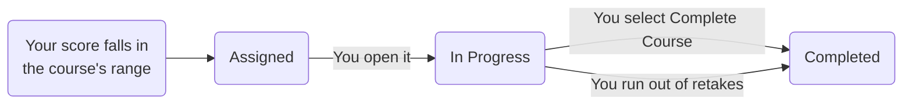

**Courses** in the left sidebar holds the training assigned to you. Vela assigns courses on your organisation's [evaluation cycle](../reference/glossary.md#evaluation-cycle), based on how you have scored, so a course arrives because your figures qualified you for it rather than because someone picked you.

---

## Before You Begin

You need:

- **A course assigned to you.** Your team lead creates courses and sets a [**Training Initiation Score Range**](../reference/glossary.md#training-initiation-score-range) on each course. Until your scores fall in a range, the list is empty.
- **To know your organisation's pass percentage.** Your team lead sets one for every course, so it is the same whichever course you take.

---

## 1. Find Your Courses

Select **Courses** in the left sidebar. The page groups what you have by where you are with it:

| Group | What it holds |
| :--- | :--- |
| **Assigned Courses** | Assigned to you, not started |
| **Courses In Progress** | Opened and part-way through |
| **Completed Courses** | Finished, as a table rather than cards, with your result |

**Search**, **Sort**, and **Filter** sit above the list for when you have more than a screenful.

Each course shows its **Due Date**. Start early enough to finish before it.

---

## 2. Work Through the Material

Select **View Course** to open one. The page opens on a description of what it covers, and the material sits below.

{/* Two independent captures (quick-search.png above and course-actions.png below) both show View Course on an Assigned-status card, not Start Course. AgentCourseView.jsx ties Start Course to status === "assigned", but the live product no longer matches that. Updated this step to what the screen actually shows. */}

Material comes in two forms, and a course can carry both:

- **Course Material** is a PDF your team lead uploaded. Select **Download Material** to read it.
- **Course Link** is an **External Link** that opens elsewhere in a new tab.

Read the material before starting the quiz. The quiz is scored, and your result is recorded against the course.

---

## 3. Take the Quiz

Select **Take Quiz** on a course that has one. The quiz page shows the course name at the top, and each question is numbered and marked **Required**. Questions come in three forms:

| Type | What you do |
| :--- | :--- |
| **Multiple Choice** | Pick one of the options |
| **Short Paragraph** | Write a brief answer |
| **Long Paragraph** | Write a longer answer |

Written answers are compared against an answer your team lead set when building the quiz, with Vela judging the meaning rather than the exact wording. Answer the question that was asked rather than writing generally around it.

When you submit, the page shows **Quiz Completed** and your score as a percentage, shown in red if it is below the pass mark. Below that:

- If you did not pass, a line reads **You did not meet the passing score of 50%**, followed by how many retake attempts you have left. Your organisation's pass mark replaces the 50.
- Three buttons: **Return to Course**, **Retake Quiz** with the number left in brackets, and **Complete Course**.
- **Quiz Answers** lists each question with the points it earned, such as **1/3 points**.

In **Quiz Answers**, a paragraph question shows the answer you gave, and a multiple-choice question shows every option with the one you chose marked **Answer**.

The percentage on the results screen is the **Final Score** recorded against the course. **Initiation Score** sits beside it in the Completed Courses table, showing the score you had when the course was assigned to you rather than a quiz result, so the gap between the two is what the course changed.

Once a course is finished it moves to the **Completed Courses** table, whose row shows **Date Assigned**, **Due Date**, **Category**, **Initiation Score**, **Final Score**, and **Date Completed**. Select the **eye** icon in the **Actions** column to reopen the course and read back your attempt.

{/* VERIFIED 2026-09-07 against a live agent capture (DemoOrg3, Vusi Zulu): Completed Courses is a table with those columns and an eye icon in Actions, not a card with a Review Quiz button. Final Score reads N/A on a row completed without a graded attempt. */}

### How Many Attempts You Get

A course reaches **Completed Courses** two ways, and nothing on the row says which one happened:

Read the **Final Score** for how you did, not for which of the two closed the course out. A **Final Score** of **N/A** means the course was completed without a quiz result, for example by selecting **Complete Course** before taking the quiz.

Your team lead sets **Quiz Retakes** on each course, between 1 and 5, so the number is not the same on every course. Vela shows how many you have left in a few places: the quiz page reads **You have 2 retake attempts available**, the results screen reads **You have 2 retakes remaining**, and the button on the results screen reads **Retake Quiz (2 left)**.

{/* UNVERIFIED: the wording once the count reaches zero, and whether the Retake Quiz button then disappears, was not captured - the live captures show counts of 1 and 2 remaining with the button present. */}

:::warning Running out of retakes closes the course
The course moves to **Completed Courses** with the last score you got, whether or not you passed, and you cannot take it again. Check the count before you start an attempt.
:::

A low first attempt is worth spending a retake on rather than leaving. Read the material again before you use the next one.

While retakes remain, the results screen also offers **Complete Course**, beside **Retake Quiz** and **Return to Course**. Selecting it finishes the course on that attempt's score, pass or fail, without waiting for the retakes to run out. Passing alone does not finish a course, so select **Complete Course** once you are happy with a result.

---

## Check Your Work

Open **Courses** and confirm the course you finished sits under **Completed Courses** with a **Final Score** on it.

A course still under **Courses In Progress** after you submitted usually means the quiz was not submitted rather than not passed. Open it and check. A course that moved to **Completed Courses** with a score below the pass percentage means your retakes ran out.

---

## Related

- [Monitor Your Performance](./personal-performance.md): the scores that decide which courses reach you
- [View Your Awards](./your-awards.md): recognition for the work you put in
- [Review Your Interactions](./your-interactions.md): the conversations behind your scores

## Need Help?

**Contact Support:** support@botlhale.ai
