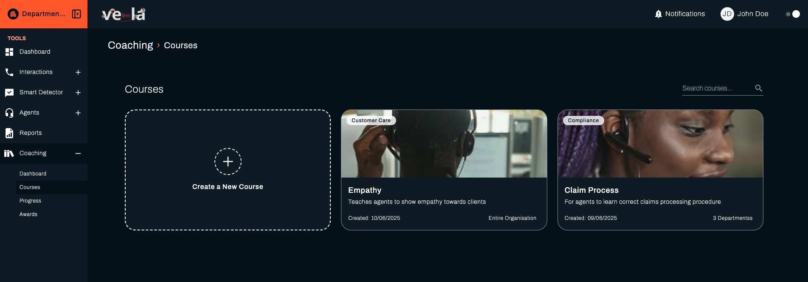
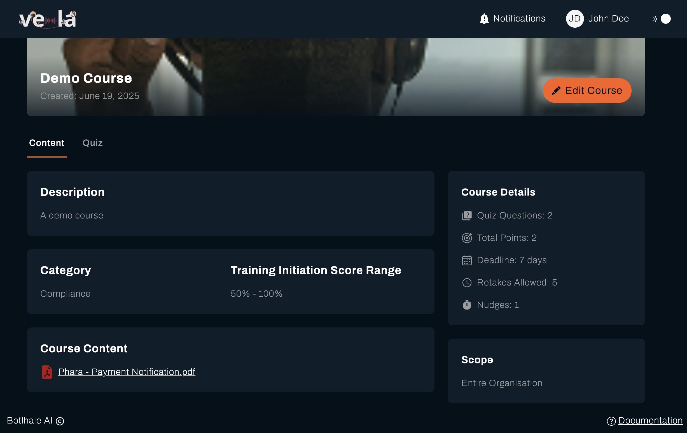

The Courses section allows team leads to create, manage, and assign training materials to agents. This guide walks you through the process of creating courses and managing your course library.

<!-- ## Table of Contents

- [Accessing the Courses Overview](#accessing-the-courses-dashboard)
- [Creating a New Course](#creating-a-new-course)
- [Viewing Course List](#viewing-course-list)
- [Managing Existing Courses](#managing-existing-courses)
- [Best Practices](#best-practices) -->

## Courses Overview

Navigating to the Courses display a list of Courses which includes several useful features:

1. **Search Bar**: Quickly find courses by name, category, or keyword
2. **Course Details Overview**: See at-a-glance metrics for each course - showing the Course Title, Description, Date Created, Categoty and Scope.

## Creating a New Course

Creating effective training materials is essential for agent development. Follow these steps to create a new course:

### Step 1: Navigate to Create Course Page

From the Courses Overview page, click the **Create a New Course** card top lef tof the screen.

### Step 2: Fill in Course Details

Complete the course creation form with the following information:

1. **Course Title**: Enter a clear, descriptive name for your course
2. **Course Description**: Provide a comprehensive overview of what the course covers
3. **Course Category**: Choose the relevant skill category
4. **Scope**: Select the appropriate scope (Entire Organisation, Specific Departments, Specific Teams)

  
  

    <iframe
      id="howdygo-frame"
      src="https://app.howdygo.com/prescreen-embed/ff13a1a2-72dc-489b-be09-7f74b6a5151b?mobileStrategy=inline&launchButton=Create+a+New+Course"
      frameBorder="0"
      scrolling="no"
      allow="clipboard-write"
      webkitAllowFullScreen
      mozAllowFullScreen
      allowFullScreen
      style={{
        position: 'absolute',
        top: '0',
        left: '0',
        width: '100%',
        height: '100%'
      }}
    />
  

### Step 3: Add Course Content

Build your course content using the content editor:

- For each module you have the following options:
  - Provide an external link to the course material resourses
  - Upload materials (PDFs)
  - Drag and drop your preferred courses cover image or use our best quality theme images

### Step 4: Add Quiz Content

Define what agents need to complete to finish the course:

1. Create questions for your course assessment
2. We support three types of questions: Short, Long Paragraphs and Multiple Choice questions
3. Provide the points/score for each question in this section
4. You also have the option to selected the expected correct answer for Multiple Choice questions
5. Mark if a question is compulsory to answer by toggling the **Required** button

### Step 5: Set Deadlines & Reminders

1. Set the number of **Quiz Retakes** which determines the number of times agents can retake the quiz if they fail.
2. Set **Deadlines** for agents in Days, Weeks or Months. This is the time agents have to complete the course after assignment.
3. Set **Course Nudges** for when to send reminders to agents to complete the course.

### Step 6: Create Course

Click **Create Course** to create course.

:::warning
Note that the platform will notify you if course creation is successful or if there were any issues with creating a course.
:::

## Course Cards

Each course is represented by a card showing:

- Course title and thumbnail/cover image
- Date created
- Scope
- Category

Click on any course card to view detailed information and management options.

## Managing Existing Courses

Effective course management ensures your training materials remain relevant and effective.

### Course Details Page

Access a course's details page by clicking on its card in the Course List. From here, you can:

1. **Edit Course**: Update content, requirements, or details
2. **View Course Content**: Description, Category, Traning Initiation Score Range, Course Details, Scope and Course Content (PDF/Link)
3. **View Course Quiz**: See the quiz questions, scores

---

## Interact with Coaching (Demo)

Find below an interactive demo for Coaching in general.

  
  

    <iframe
      id="howdygo-frame"
      src="https://app.howdygo.com/prescreen-embed/1619b05a-4e52-4d1b-a51b-32bc316fda86?mobileStrategy=inline&launchButton=Interact+with+Coaching"
      frameBorder="0"
      scrolling="no"
      allow="clipboard-write"
      webkitAllowFullScreen
      mozAllowFullScreen
      allowFullScreen
      style={{
        position: 'absolute',
        top: '0',
        left: '0',
        width: '100%',
        height: '100%'
      }}
    />
  

---

:::warning
If you encounter any issues while creating or managing courses, please contact our support team:

- Email: support@botlhale.ai
- Support Portal: [support.botlhale.ai](https://support.botlhale.ai)
  :::
