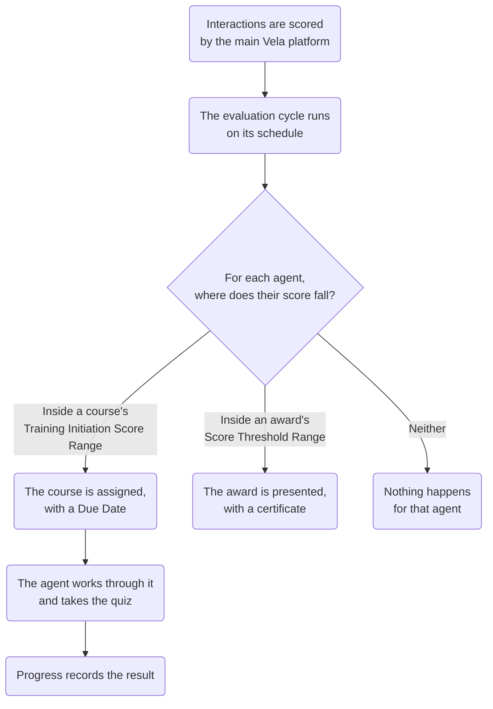

Coaching in Vela is automatic in a specific and limited sense: you define the criteria, and a scheduled job applies them. Nothing is assigned manually, and nothing is assigned continuously. This page explains what runs, when, and what the numbers it produces do and do not tell you.

---

## Coaching is an add-on, and it is off by default

The **Coaching** section appears in the left sidebar of the main Vela platform only where coaching is enabled for your organisation. Where it is not, none of this exists: no Dashboard, no Courses, no Preferences, and no portal for agents to sign in to.

This is worth knowing before troubleshooting an empty screen. An agent who cannot find their courses may not have a coaching problem at all.

---

## Everything happens on the cycle, and only on the cycle

The evaluation cycle is the single clock the whole feature runs on. It is set once, under Preferences, and it governs both courses and awards.

Between runs, nothing is assigned. A course you create this morning reaches nobody until the next run, however obviously some agent qualifies for it. This is the single most common reason a team lead thinks coaching is broken when it is working exactly as configured.

It also means the cycle length is a real decision rather than a formality. A monthly cycle judges an agent on a month of work and responds within a month. A daily cycle responds within a day, on a day's evidence, which is rarely enough to distinguish a weakness from a bad shift.

---

## Assignment is by score, never by name

There is no control anywhere that assigns a course to a named person. You describe a band of scores, and whoever falls inside it on the day the cycle runs receives the course.

Two settings shape who that is:

- **Scope** decides who is eligible at all: the whole organisation, chosen departments, or chosen teams.
- **Training Initiation Score Range** decides which of those eligible people qualify on this run.

Scope is a fence, and the score range is a filter applied inside it. An agent outside the scope never qualifies whatever they score.

This design has a consequence worth stating plainly: coaching follows the scores, so it inherits whatever the scores are measuring. If your scorecard does not ask about the thing you want to coach, no range you set finds the people who need it.

---

## A range is a band, not a threshold

Both courses and awards use two numbers rather than one, and both are inclusive of the space between them rather than everything above or below.

An award set to 80 to 100 recognises the top of the team. An award set to 70 to 79 recognises a specific tier and deliberately excludes the people above it, which is how you build a ladder rather than a single prize.

The same applies to courses in reverse. A course set to 0 to 100 is assigned to everyone, including the people who are already good at it, and it produces no evidence about whether it worked. A narrower band leaves a group who did not receive it, and the comparison between the two groups on the next cycle is the only real measure of whether the training changed anything.

---

## What the scores can carry, and what they cannot

Coaching scores come from the main Vela platform's analysis of interactions. They are good at some things and poor at others, and the difference matters when you are about to have a conversation with someone about their performance.

They are reliable for **volume and consistency**: whether a requirement was met across many calls, whether one agent differs from their team, whether a figure moved after training. These are the questions the Dashboard is built to answer.

They are weaker on **anything requiring context about the individual call**. A low score on a difficult customer and a low score on a careless one read the same. This is why the **Reviewed Interactions Only** setting exists: choosing it means coaching follows work a person has checked, rather than the analysis alone.

The practical rule: use the scores to decide **who to look at**, and look at the interactions to decide **what to say**. A course built from a category average without opening a single call is a guess with a number attached to it.

---

## Auto-fails are a different kind of signal

An auto-fail takes an interaction to zero regardless of everything else that went well. It is not a low score, it is a failed requirement.

That difference should change what you do. A category average that has drifted down a few points is a coaching conversation. A rising auto-fail rate is usually one specific, nameable requirement being missed, and it is often faster to fix by telling people the requirement than by assigning training about the general area.

Because an auto-fail zeroes the interaction, it also pulls the agent's average down hard. An agent with one auto-fail and otherwise strong work can land inside a course's score range for reasons that have nothing to do with the course's subject. Check the auto-fail figure before concluding that a low average means a broad weakness.

---

## The results are recorded, not judged

Vela records what happened: who was assigned what, when it was due, what they scored, and what they scored the first time. It does not decide whether an agent is improving, and it does not escalate anything.

That is deliberate, and it puts the judgement where it belongs. **Progress** shows you a course nobody started and a course everybody passed at 100%, and treats them the same. Both are worth your attention, for opposite reasons, and only a person can tell which is which.

---

## Related

- [How the Pieces Fit Together](./how-the-pieces-fit.md): which setting depends on which
- [Best Practices](./best-practices.md): what to do with all of this in a working week
- [Set Coaching Preferences](../team-leads/coaching-preferences.md): the cycle this page describes
- [Read the Coaching Dashboard](../team-leads/coaching-dashboard.md): where the scores are read

## Need Help?

**Contact Support:** support@botlhale.ai
