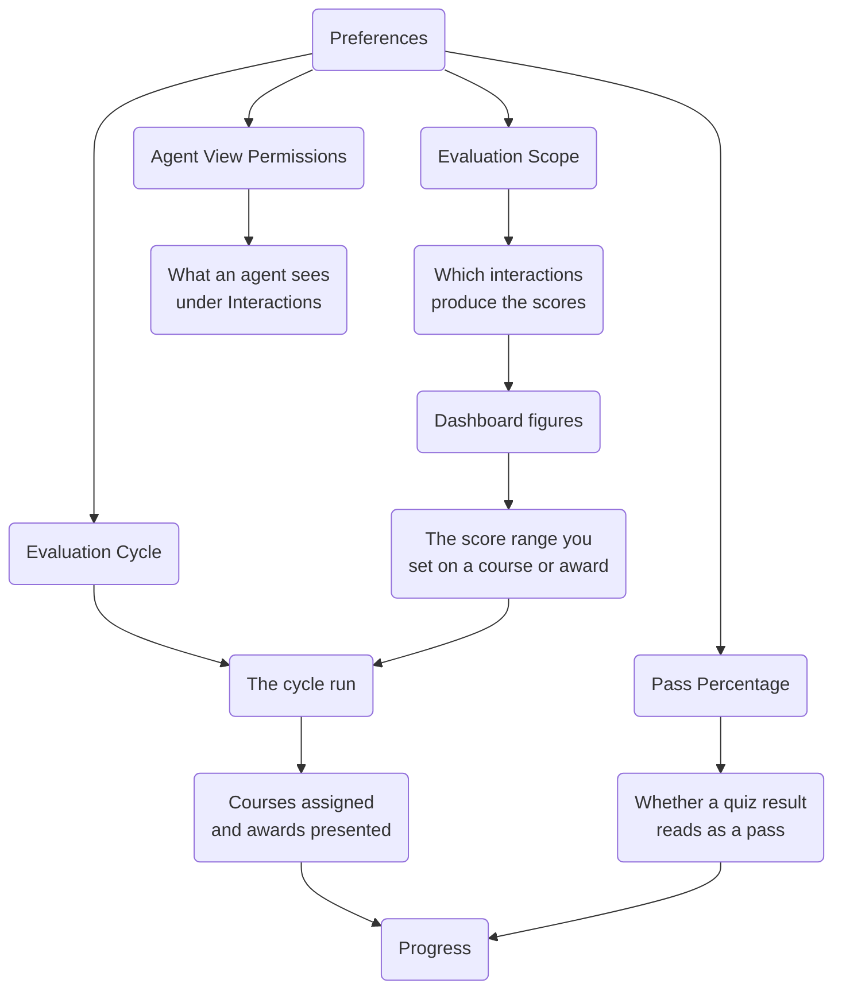

The Coaching Portal has few settings, but they depend on one another in ways that are not obvious from any single page. Most of the confusion reported about coaching comes from a setting doing exactly what it says while a different one quietly decides the outcome.

This page maps those dependencies.

---

## The two sides of the product

Coaching spans two applications that look nothing alike.

| | Where it lives | Who signs in |
| :--- | :--- | :--- |
| **The coaching side of Vela** | **Coaching** in the main Vela sidebar | Team leads, QA managers, administrators |
| **The Agent Portal** | A separate portal at its own address | Agents |

A team lead never sees the portal an agent uses, and an agent never sees the Coaching section. This is why the documentation is split by audience rather than by feature, and why a team lead cannot answer "what does this look like on my screen?" for an agent from memory.

What connects them is the evaluation cycle. Team leads define, the cycle distributes, and agents receive.

---

## What depends on what

Preferences sits at the top of everything. Its four settings fan out into the rest of coaching: **Evaluation Scope** decides which interactions produce the scores, and those scores, broken down by category, are what the Dashboard shows and what a course or award range is measured against. That range always checks the agent's score in one specific **Category**, never their overall score. **Evaluation Cycle** decides when that measurement runs, and the run is what assigns courses and presents awards, which is what Progress then records. **Pass Percentage** decides whether a quiz result in Progress reads as a pass. **Agent View Permissions** sits apart from all of it, governing only what an agent can open under Interactions.

Read from the top: Preferences governs everything. Nothing else in coaching overrides it, and no course or award carries its own cycle or its own pass percentage.

---

## The dependencies that catch people out

### Evaluation Scope decides the scores, which decide the assignment

**Evaluation Scope** looks like a small setting about which interactions count. It is not. It decides the scores on the Dashboard, and the Dashboard scores decide who falls inside a course's range.

Set it to **Reviewed Interactions Only** and coaching runs on human-checked work, which is stricter and usually fairer. It also means that if reviewing falls behind, the scores stop moving, and courses stop reaching the people who need them. The setting is sound. The backlog is what breaks it.

Set it to **All Interactions** and nothing stalls, but the coaching follows the analysis alone.

Neither is wrong. What causes trouble is choosing one and forgetting it while diagnosing why nobody is being assigned anything.

### The pass percentage is organisation-wide, and the retakes are per course

These two look like they belong together and they do not.

**Pass Percentage** is set once, under Preferences, and applies to every quiz in the organisation. **Quiz Retakes** is set on each course individually, between 1 and 5.

So the difficulty of passing is uniform, but how many chances an agent gets is not. Two agents failing the same mark on different courses may have very different amounts of room left.

### Agent View Permissions is retroactive

Most settings here apply from the next cycle onwards. **Agent View Permissions** is not one of them.

It controls what an agent can open under **Interactions** right now. Changing it from **All Interactions** to **Reviewed Interactions Only** removes access to work they could see yesterday, including interactions they have already read.

Agree it before agents are invited. Changing it afterwards is visible to them and reads as something being taken away.

### Scope caps what your own access allows

The **Scope** control's options depend on your own access level rather than being the same for everyone. Organisational access sees **Entire Organisation**, **Specific Departments**, and **Specific Teams**. Departmental access never sees an organisation-wide option at all, only **Entire Department** and **Specific Teams**. Team access sees no selector, only a fixed line naming your own team.

This is why a departmental-access team lead cannot build a course that reaches another department: the option to try is never offered, not shown and then blocked.

---

## What each screen is actually for

Once the dependencies are clear, the screens divide cleanly by the question they answer.

| Screen | The question it answers |
| :--- | :--- |
| **Dashboard** | Who needs attention, and in what |
| **Courses** | What training exists, and who it reaches |
| **Progress** | What happened to the training that was assigned |
| **Awards** | What has been recognised, and who has it |
| **Preferences** | The rules all of the above run under |

The order matters. Reading the Dashboard before building a course is the difference between training aimed at a gap and training aimed at nothing in particular. Reading Progress after a cycle is the only way to find out whether any of it landed.

---

## A worked sequence

A first month of coaching, in the order the dependencies require:

1. **Set Preferences first.** The cycle, the pass percentage, the evaluation scope, and the agent view setting. Everything downstream inherits these, and two of them are awkward to change later.
2. **Read the Dashboard.** Find a category several agents are behind in. One agent behind is a conversation, not a course.
3. **Build one course** around that category, with a score range covering the agents you saw and not the whole team.
4. **Wait for the cycle.** Nothing is assigned before it runs. This is the step people skip.
5. **Open Progress.** Confirm agents are assigned to the course, shown with a **Date Assigned**. Nobody there means the range missed, not that coaching is broken.
6. **Read the Dashboard again next cycle.** Compare the agents who received the course with those who did not. That comparison is the only evidence the course worked.
7. **Create an award** once there is something real to recognise.

---

## Related

- [How Coaching Works](./how-coaching-works.md): what the cycle does and what the scores mean
- [Best Practices](./best-practices.md): the same sequence as a working habit
- [Set Coaching Preferences](../team-leads/coaching-preferences.md): the settings at the top of the chain
- [Troubleshooting](../support/troubleshooting-guide.md): when the chain produces nothing

## Need Help?

**Contact Support:** support@botlhale.ai
