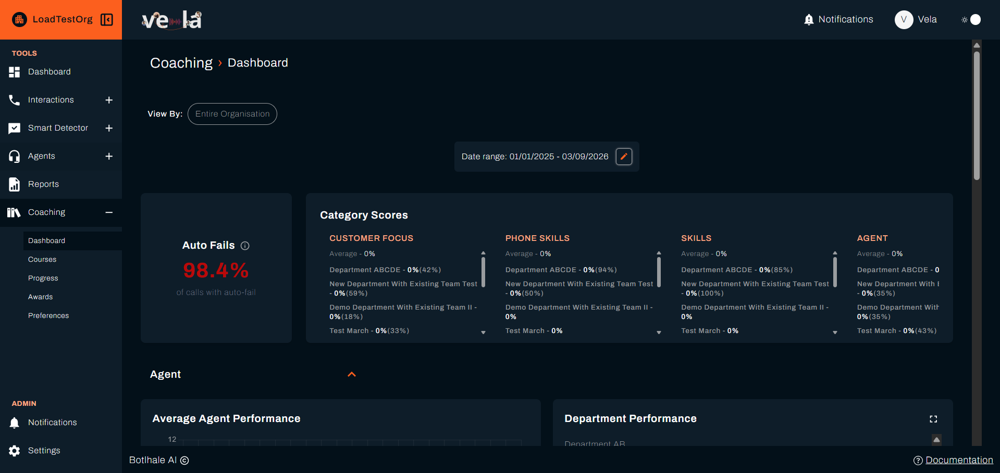
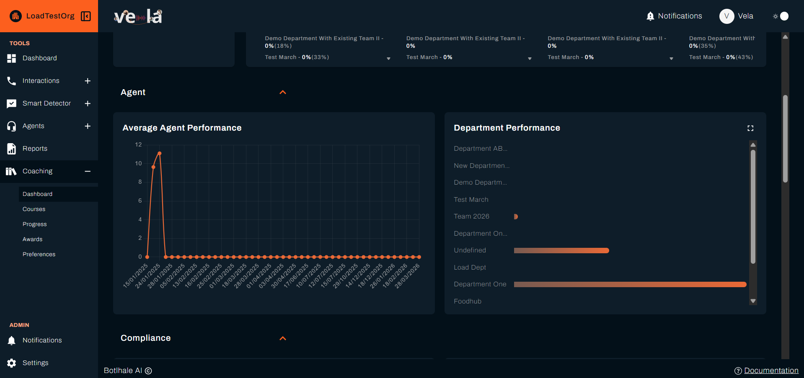

**Coaching → Dashboard** shows how the agents you cover are scoring over a period you choose. Use it to decide who needs a conversation and what that conversation should be about, before you build a course or open individual interactions.

---

## Before You Begin

You need:

- **Processed interactions in the period.** The Dashboard is built from analysed calls and chats, so a period with none is empty rather than broken.
- **Access covering the agents you want to see.** Your access level decides whether you see the whole organisation, a department, or one team.

---

## 1. Set the Period and the Scope

Select **Coaching** in the left sidebar, then **Dashboard**.

Two controls at the top of the page decide what everything below is calculated from.

**View By** sets how much of the organisation you are looking at. It opens on **Entire Organisation** and narrows to a department or a team. What it offers you stops at your access level, so a team lead sees fewer choices than an administrator.

**Date range** sets the period. Select the **pencil** beside it to change the dates.

Pick a period long enough to hold several interactions per agent. A week is usually the shortest useful range, and a month is better for judging a trend.

---

## 2. Read the Figures

Two cards sit side by side below the controls, and they are read together.

### A. Auto Fails

**Auto Fails** is a single percentage: the share of calls in the period that failed a question your organisation marks as critical, across everything **View By** covers. The **information** icon beside the heading explains the figure in place.

An auto-fail takes an interaction to zero whatever else went well, so a rising figure here matters more than a few points off an average. It usually points at one requirement being missed repeatedly rather than at general performance.

Read this figure before the panel beside it, because a high auto-fail rate is what makes the scores in **Category Scores** collapse.

### B. Category Scores

**Category Scores** breaks performance down by the categories your organisation groups its scorecard questions into. Each category is a column with its heading in capitals.

The panel scrolls two ways, and the second one is often missed. It scrolls **sideways** through the categories, with a **chevron** appearing on whichever side has more to show and a **Scroll for more** hint at the foot. Each column also scrolls **down** on its own where it holds more groups than fit.

Every column reads the same way:

| Line | What it is |
| :--- | :--- |
| The heading | The category name |
| **Average** | The figure across everything **View By** covers |
| The lines below | The same figure for each department or team within it |

Two numbers can appear on a line, as in `department one - 4%(36%)`:

- The **first** figure is the score with auto-fails applied.
- The figure **in brackets** is what was earned on the question wording alone, before auto-fails zeroed it.

The bracket only appears when the two differ. A line with one figure had no auto-fails in that category, so nothing was taken away.

That gap is the useful part. A line reading `0%(71%)` is not a group that knows nothing about the category. It is a group doing most of the category correctly whose score is being wiped by a critical failure. Coaching that failure recovers the whole column, and coaching the category does not.

:::tip Where the coaching list comes from
Read across a category and find the groups whose bracketed figure is high while the first figure is low. Those are being held back by one requirement, which is a specific and fixable conversation. A group low on both figures is a broader gap that a course suits better.
:::

Where a category has no interactions in the period, its column reads **No team data available** rather than showing zeroes.

### C. Per-Category Performance

Below the two cards, every category gets its own section, with the category name as the heading and a **chevron** to collapse it.

Each section holds two charts for that category alone:

| Chart | What it shows |
| :--- | :--- |
| **Average Agent Performance** | A line across the period, so you can see when performance moved rather than only where it ended |
| The grouped bar chart | A bar for each group, so you can see which part of the organisation carries the result |

:::note The bar chart is named after whatever you grouped by
Its heading is built from two things: the category, and what **View By** is set to. Viewing departments in the Compliance category, it reads **Compliance - Department Performance**. Change **View By** and the heading changes with it, to **Team Performance** or **Agent Performance**. There is no chart called Department Performance in its own right.
:::

The **fullscreen** control on a chart expands it, which is worth using on the bar chart where long names are cut short.

Read the line chart for timing and the bars for location. A drop that starts on one date points at something that happened, such as a process change or a new intake. A drop confined to one group points at that group.

A category with nothing in the period reads **There is no data available in this category for the selected date range**. That is an empty period rather than a fault, and widening the date range is the first thing to try.

---

## 3. Decide What to Do

The Dashboard tells you where the gap is. What you do about it is one of three things:

| What you see | What to do |
| :--- | :--- |
| One agent behind in one category | Open a few of their interactions and leave coaching comments |
| Several agents behind in the same category | Build a course whose **Training Initiation Score Range** covers them |
| An agent behind everywhere | A direct conversation, before anything automated |

See [Create and Assign Courses](./create-and-assign-courses.md) for the second, and [Recognise Good Work](./recognise-good-work.md) for marking improvement once it comes.

---

## Check Your Work

Set the date range to a period you know holds interactions and confirm the panels fill.

An empty Dashboard means no processed interactions fall in the dates, or your access level does not cover the agents you expected. Widen the range first, then check the access level with an administrator.

---

## Related

- [Create and Assign Courses](./create-and-assign-courses.md): turn a category gap into training
- [Track Learning Progress](./track-learning-progress.md): see whether the training landed
- [Recognise Good Work](./recognise-good-work.md): mark the improvement when it arrives
- [Set Coaching Preferences](./coaching-preferences.md): the cycle that drives assignment

## Need Help?

**Contact Support:** support@botlhale.ai
