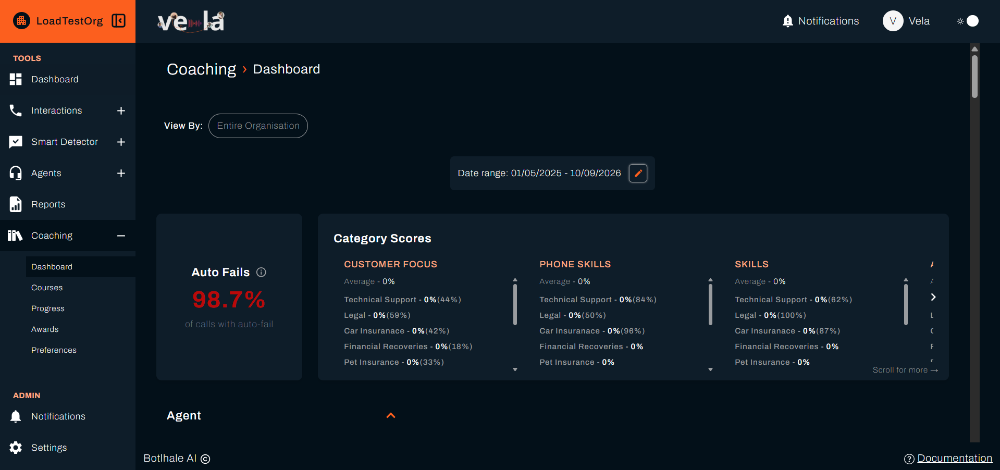
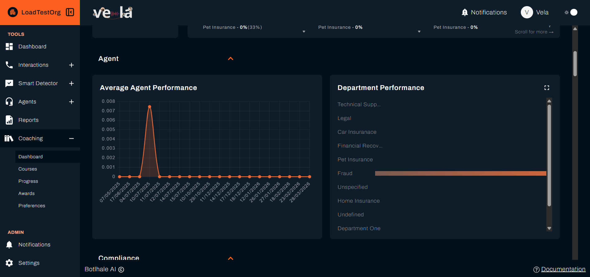

As a team lead, you use the **Dashboard** under **Coaching** in the main Vela platform to see how the agents you cover are scoring over a period you choose. Use it to decide who needs a conversation and what that conversation should be about, before you build a course or open individual interactions.

---

## Before You Begin

You need:

- **Processed interactions in the period.** The Dashboard is built from analysed calls and chats, so a period with none is empty rather than broken.
- **Access covering the agents you want to see.** Your access level decides whether you see the whole organisation, a department, or one team.
- **Reviewed interactions, where your organisation counts only those.** Where **Evaluation Scope** under **Preferences** is **Reviewed Interactions Only**, the Dashboard counts reviewed interactions only.

---

## 1. Set the Period and the Scope

Select **Coaching** in the left sidebar, then **Dashboard**.

Two controls at the top of the page decide what everything below is calculated from:

| Control | What it does |
| :--- | :--- |
| **View By** | How much of the organisation you are looking at. Opens on the broadest scope your access level allows, **Entire Organisation** for organisational access, **Entire Department** for departmental access, or your own team for team access. Team access offers fewer choices than organisational access |
| **Date range** | Sets the period. Select the **pencil** beside it to change the dates |

Pick a period long enough to hold several interactions per agent. A week is usually the shortest useful range, and a month is better for judging a trend.

---

## 2. Read the Figures

Two cards sit side by side below the controls, shown above, and they are read together.

### A. Auto Fails

**Auto Fails** is a single percentage, the share of calls in the period that failed a question your organisation marks as critical, across everything **View By** covers. The **information** icon beside the heading explains the figure in place.

An auto-fail takes an interaction to zero whatever else went well, so a rising figure here matters more than a few points off an average. It usually points at one requirement being missed repeatedly rather than at general performance.

Read this figure before the panel beside it, because a high auto-fail rate is what makes the scores in **Category Scores** collapse.

### B. Category Scores

**Category Scores** breaks performance down by the categories your organisation groups its scorecard questions into. Each category is a column with its heading in capitals.

The panel scrolls two ways, and the second one is often missed. It scrolls **sideways** through the categories, with an **arrow** appearing on whichever side has more to show and a **Scroll for more** hint at the foot. Each column also scrolls **down** on its own where it holds more groups than fit.

Every column reads the same way:

| Line | What it is |
| :--- | :--- |
| The heading | The category name |
| **Average** | The figure across everything **View By** covers |
| The lines below | The same figure for each department, team, or agent one level below what **View By** covers |

Two numbers can appear on a line, as in `department one - 4%(36%)`:

- The **first** figure is the score with auto-fails applied.
- The figure **in brackets** is the score without the auto-fail rule. The failed critical question still counts as zero in it.

The bracket only appears when the two differ. A line with one figure had no auto-failed interactions, so nothing was taken away.

An auto-fail removes an interaction's points from every category, not only the category its critical question belongs to. So a collapsed figure in one category can come from a critical question in another.

{/* VERIFIED 2026-10-01 on origin/vela-fly: app/(pages)/coaching/dashboard/dashboard.js works out autoFailed once per call, across all questions, and then withholds that call's points (failScore) in every category. */}

That gap is the useful part. A line reading `0%(71%)` is not a group that knows nothing about the category. It is a group doing most of the category correctly whose score is being wiped by a critical failure, which may be a question in another category. Coaching that failure recovers the whole column, and coaching the category does not.

:::tip Where the coaching list comes from
Read across a category and find the groups whose bracketed figure is high while the first figure is low. Those are being held back by one critical requirement, which may sit in another category. That is a specific and fixable conversation. A group low on both figures is a broader gap that a course suits better.
:::

Only categories with interactions in the period appear as columns.

{/* VERIFIED 2026-09-21 against dashboardPage.jsx on origin/main: a column reads "No team data available" only when a category has an Average but no group breakdown beneath it, that is, when dashboardCategoryScores holds the category and dashboardCategoryAgentScores does not. Both are built from the same calls, so two live checks on 2026-09-07 (View By set to Entire Organisation, and to Specific Teams, each with an empty date range) never reached it: an empty period collapses the whole area to "No data available for the selected date range. Try adjusting your filter." with no columns at all. Not documented as a state, for want of one that shows it. */}

### C. Per-Category Performance

Below the two cards, every category gets its own section, with the category name as the heading and an **arrow** to collapse it.

Each section holds two charts for that category alone:

| Chart | What it shows |
| :--- | :--- |
| **Average Agent Performance** | A line across the period, so you can see when performance moved rather than only where it ended |
| **Department Performance**, **Team Performance**, or **Agent Performance** | A bar for each group, so you can see which part of the organisation carries the result |

:::note The expanded chart adds the category to its heading
In its normal place on the page, the bar chart's heading reads only **Department Performance**, **Team Performance**, or **Agent Performance**, one level below what **View By** covers. It reads **Department Performance** under **Entire Organisation**, **Team Performance** under a department choice, and **Agent Performance** under **Specific Teams**, **Entire Team**, or **Specific Agents**. Select the **fullscreen** control to expand it, which is worth doing where long names are cut short. The heading then gains the category in front, for example **Compliance - Department Performance**. The category prefix only appears in the expanded view.
:::

Read the line chart for timing and the bars for location. A drop that starts on one date points at something that happened, such as a process change or a new intake. A drop confined to one group points at that group.

---

## 3. Decide What to Do

The Dashboard tells you where the gap is. What you do about it is one of three things:

| What you see | What to do |
| :--- | :--- |
| One agent behind in one category | Open a few of their interactions and leave coaching comments |
| Several agents behind in the same category | Build a course whose **Training Initiation Score Range** covers them |
| An agent behind everywhere | A direct conversation, before anything automated |

See [Create and Assign Courses](./create-and-assign-courses.md) for the second, and [Recognise Good Work](./recognise-good-work.md) for marking improvement once it comes.

---

## Check Your Work

Set the date range to a period you know holds interactions and confirm the panels fill.

An empty Dashboard shows **No data available for the selected date range. Try adjusting your filter**. It has three usual causes:

- No processed interactions fall in the dates.
- **Evaluation Scope** is **Reviewed Interactions Only**, and nothing in the dates has been reviewed.
- Your access level does not cover the agents you expected.

Widen the range first, then check **Evaluation Scope** and your access level. The same message also appears when the figures fail to load, so reload the page if the range is clearly right.

{/* VERIFIED 2026-10-01 on origin/vela-fly: app/components/charts/performanceCharts.jsx sets hasData = true, so the per-category "There is no data available in this category" message never renders. Removed from this page. */}

---

## Related

- [Create and Assign Courses](./create-and-assign-courses.md): turn a category gap into training
- [Track Learning Progress](./track-learning-progress.md): see whether the training landed
- [Recognise Good Work](./recognise-good-work.md): mark the improvement when it arrives
- [Set Coaching Preferences](./coaching-preferences.md): the cycle that drives assignment

## Need Help?

**Contact Support:** support@botlhale.ai
