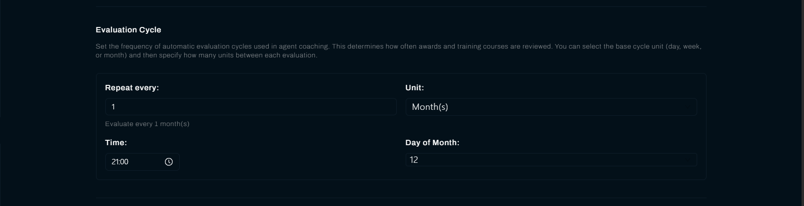
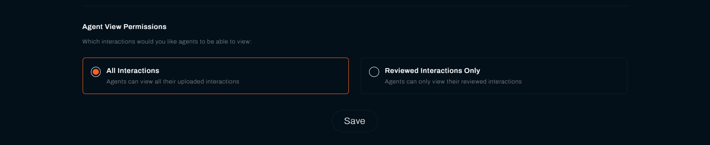

**Preferences** holds the settings that govern all coaching in your organisation: how often Vela evaluates agents, what counts as passing a course, which interactions evaluations are based on, and how much of their own work agents can see. These apply organisation-wide rather than per course or per agent.

---

## Before You Begin

You need:

- **Organisational access and the admin role.** The form is read-only unless you have both. Someone with organisational access but a different role can see these settings and not change them.
- **To decide before agents are invited.** The agent view setting changes what people have already been able to see, so agree it early rather than after.

---

## 1. Set the Evaluation Cycle

The evaluation cycle is how often Vela reviews agents' scores and assigns the courses and awards they qualify for. Nothing is assigned between runs, so this setting decides how quickly coaching responds to a change in performance.

| Field | What it does |
| :--- | :--- |
| **Repeat every** | How many units between runs, from 1 to 100 |
| **Unit** | **Day(s)**, **Week(s)**, or **Month(s)** |
| **Time** | The time of day the run happens |
| **Day of Week** | Which day, when the unit is week |
| **Day of Month** | Which date, when the unit is month. The list runs 1 to 28, plus **Last** |

The page confirms your choice back to you, reading **Evaluate every 1 month(s)** or similar.

Monthly suits most teams. Weekly responds faster but assigns courses on less evidence, so an agent can be given training for a bad week rather than a real gap.

**Day of Month** stops at 28, with **Last** as the alternative. There is no 29th, 30th, or 31st, because those dates do not exist in every month. Where you want the end of the month, choose **Last**.

---

## 2. Set the Pass Percentage

{/* SCREENSHOT NEEDED: the Courses section of Preferences, showing the Pass Percentage input and the question above it. Suggested path: img/screenshots/team_lead/preferences/pass-percentage.png */}

**Pass Percentage** is the share of the total quiz score an agent reaches to pass a course. It applies to every course, so it is set here rather than on each course.

---

## 3. Choose What Evaluations Are Based On

{/* SCREENSHOT NEEDED: the Evaluation Scope section with both radio cards, All Interactions and Reviewed Interactions Only, and the selected one outlined. Suggested path: img/screenshots/team_lead/preferences/evaluation-scope.png */}

Under **Evaluation Scope**, answer "Which interactions would you like these evaluations to apply to":

| Option | What it means |
| :--- | :--- |
| **All Interactions** | Every processed interaction counts towards evaluation |
| **Reviewed Interactions Only** | Only interactions a person has marked as reviewed count |

**Reviewed Interactions Only** is the stricter setting. It means coaching follows human-checked work rather than AI scores alone, which is worth having if your reviewers add context. It also means an unreviewed backlog stops evaluations running, so pick it only if your team keeps up with reviewing.

---

## 4. Choose What Agents Can See

Answer "Which interactions would you like agents to be able to view":

| Option | What it means |
| :--- | :--- |
| **All Interactions** | Agents can view all their uploaded interactions |
| **Reviewed Interactions Only** | Agents can only view their reviewed interactions |

Reviewed-only is worth considering where your reviewers add context that changes how a score reads. It also means an unreviewed backlog is invisible to the agent, so their portal looks emptier than their work has been.

Agree this before agents are invited. Changing it later changes what they have already been able to see.

---

## 5. Save

Select **Save** to apply your changes.

---

## Check Your Work

Reopen **Preferences** and confirm the settings read back as you set them.

For the cycle, the real check is the next run. Open **Progress** after the time you set and confirm courses have been assigned with that date. See [Track Learning Progress](./track-learning-progress.md).

---

## Related

- [Create and Assign Courses](./create-and-assign-courses.md): the courses this cycle assigns
- [Recognise Good Work](./recognise-good-work.md): the awards this cycle presents
- [Track Learning Progress](./track-learning-progress.md): confirm a cycle has run
- [Review Your Interactions](../agents/your-interactions.md): what an agent sees under each view setting

## Need Help?

**Contact Support:** support@botlhale.ai
