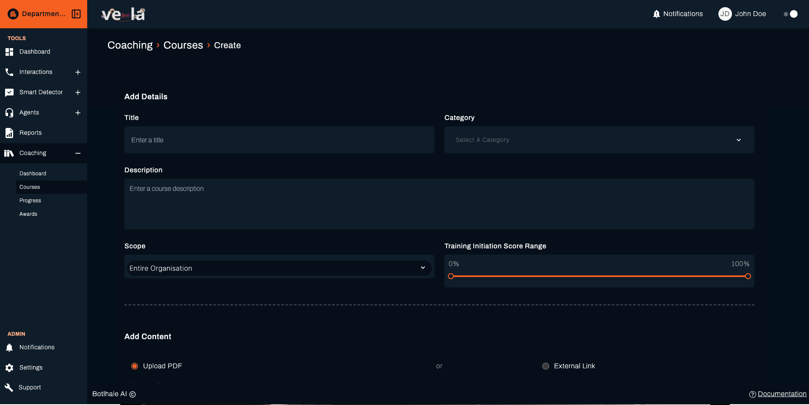
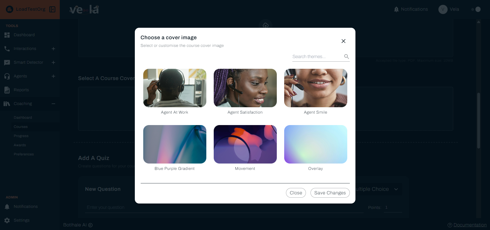
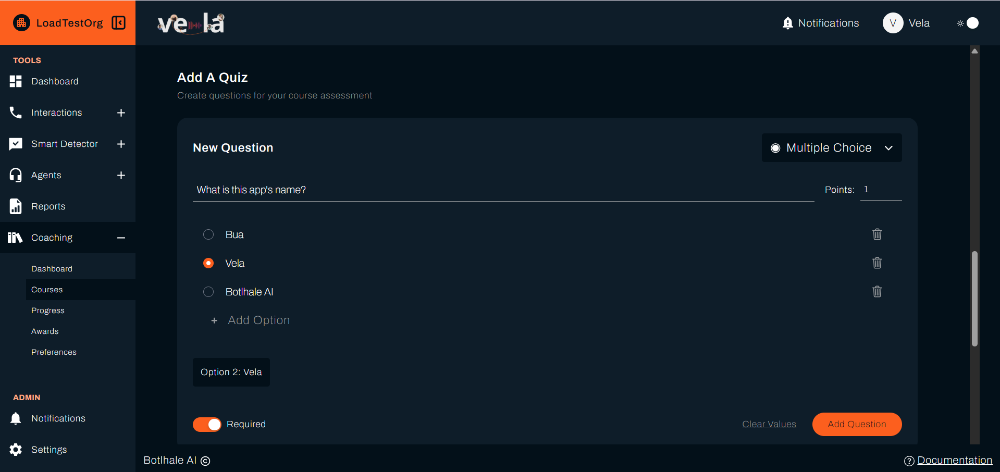
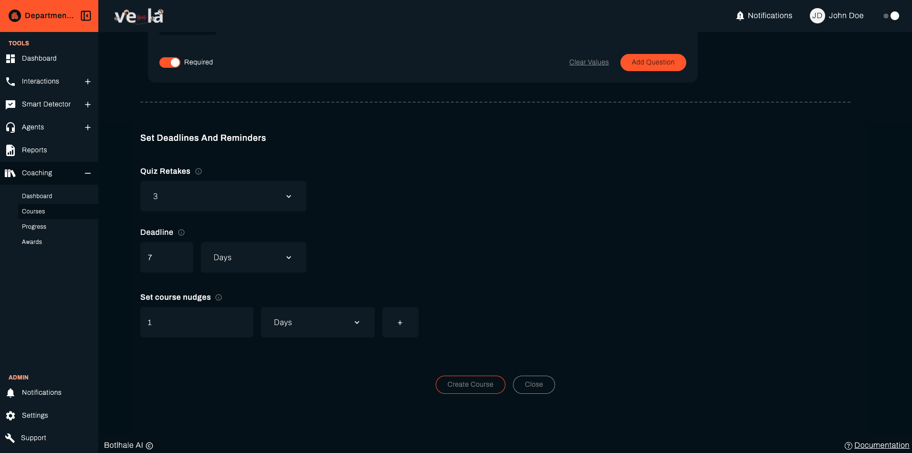

A course is training you build once and Vela assigns automatically. You set the score range that assigns it, and on each evaluation cycle every agent whose scores fall in that range receives it. Courses reach people by score rather than by name, so you set the criteria rather than picking individuals.

---

## Before You Begin

You need:

- **A gap worth training.** Build the course around a category several agents are behind in. See [Read the Coaching Dashboard](./coaching-dashboard.md).
- **Your material ready.** A file to upload, a link to point at, or both.
- **To know your evaluation cycle.** Assignment happens on the cycle set under Preferences, so a course created today reaches agents at the next run rather than immediately. See [Set Coaching Preferences](./coaching-preferences.md).

---

## 1. Open the Courses Page

Select **Coaching** in the left sidebar, then **Courses**. The page lists what already exists, so check whether a course covering this gap is already there before building another.

Select **Create Course** to start a new one.

---

## 2. Describe the Course

On **Create a New Course**, fill in the details:

| Field | What it does |
| :--- | :--- |
| **Title** | The name of the course. It is the **Course Title** agents see in their list |
| **Description** | What the course covers, and why it was assigned |
| **Category** | Groups related courses. Select **Enter category name** to add a new one |

Write the description for the agent receiving it. "Improve compliance" says less than "Covers the disclosures required at the start of a call, and when each applies."

---

## 3. Add the Material

A course holds what the agent works through. There are two kinds, and a course may use both:

{/* SCREENSHOT NEEDED: the Upload PDF drop area and the External Link field, with the "Accepted file type: PDF. Maximum size: 10MB" line visible beneath the drop area. The only capture in this step shows the cover image picker, not the material controls. Suggested path: img/screenshots/team_lead/courses/create-course-material.png */}

- **Upload PDF**: drag and drop a file, or select the area to browse. The form states the rule beneath it: *Accepted file type: PDF. Maximum size: 10MB.* A file in any other format is refused, and one over the limit reports **File size exceeds 10MB limit**.
- **External Link**: a URL that opens elsewhere, for material you host outside Vela.

:::note PDF is the only accepted upload
The upload control accepts `.pdf` and nothing else. Where your material is a slide deck, a document, or a video, either export it to PDF or host it and point **External Link** at it.
:::

You can also choose a cover image for the course, either from the supplied theme images or by uploading your own.

---

## 4. Add a Quiz

Select **Add Question** for each question you want to ask. Every question needs its text and an answer type:

| Answer type | What the agent does | What you set |
| :--- | :--- | :--- |
| **Multiple Choice** | Picks one of the options | At least two options, and which is the **Correct Answer** |
| **Short Paragraph** | Writes a brief answer | The question only |
| **Long Paragraph** | Writes at length | The question only |

A multiple choice question is refused until it has at least two options and one of them is marked correct. Use **Add option** to build the list.

Paragraph answers have no correct answer to set, because they are not marked by comparison. Vela scores them, and records a short reason for the score against each question, which the agent sees with their result. Write those questions so there is something specific to judge: "Name the two disclosures required before taking payment" can be scored, "What did you think of this course?" cannot.

Use **Edit Question** and **Remove** to change a question you have already added.

### Quiz Retakes

{/* SCREENSHOT NEEDED: the Quiz Retakes selector open, showing the 1 to 5 options. Undocumented until now and easy to miss on the form. Suggested path: img/screenshots/team_lead/courses/create-course-retakes.png */}

**Quiz Retakes** sets how many attempts an agent gets at the quiz, from 1 to 5. New courses start at 3.

Retakes matter more than they look. When an agent uses their last one, the course is marked complete whatever they scored, so the number you set here decides how long a struggling agent can keep trying before the course closes on them. Their first result is kept separately as the **Initiation Score**, so improvement across attempts stays visible.

The pass mark itself is set once for all courses under Preferences, not per course. See [Set Coaching Preferences](./coaching-preferences.md).

---

## 5. Set the Score Range That Assigns It

{/* SCREENSHOT NEEDED: the Training Initiation Score Range slider with both handles set to a narrow band, so the floor and ceiling percentages either side of it are legible. This is the control that decides who receives the course and it has no capture. Suggested path: img/screenshots/team_lead/courses/create-course-score-range.png */}

**Training Initiation Score Range** is the setting that decides who receives the course. It is a slider with two handles over 0 to 100, and the percentages either side of it show the floor and ceiling you have set. On each evaluation cycle, every agent in scope whose score falls between them is assigned the course.

Set it around the gap you found on the Dashboard rather than around a pass mark. A range of 0 to 100 assigns the course to everyone, which tells you nothing about whether it worked. A range of 40 to 65 reaches the people who are struggling with the thing this course teaches, and leaves a comparison group who did not need it.

The range is a band, not a threshold. An agent above the ceiling does not receive the course, which is deliberate: training aimed at a weakness is wasted on someone who does not have it.

---

## 6. Set the Deadline and Scope

**Deadline** is how long an agent has from the date the course is assigned to them, rather than a fixed calendar date. It takes a count and a unit, and the unit is **Days**, **Weeks**, or **Months**. Each agent's **Due Date** is worked out from the day they receive it, so two agents who qualify on different cycles get the same amount of time rather than the same date.

{/* SCREENSHOT NEEDED: the Scope control set to Departments, with the department multi-select open. Suggested path: img/screenshots/team_lead/courses/create-course-scope.png */}

**Scope** limits who the course can reach: the whole organisation, chosen departments, or chosen teams. Choosing departments or teams reveals a selector for which ones, and the course is refused until you pick at least one. Your own access level caps what you may set here.

Scope and the **Training Initiation Score Range** work together rather than instead of each other. Scope decides who is eligible at all. The score range decides which of those people qualify on a given cycle.

Select **Create** to save. The course is assigned on the next evaluation cycle.

---

## 7. Edit a Course

Open a course from the list and select **Edit Course** to change its details, material, or questions.

Editing changes the course for agents who have not yet completed it. Agents who already finished keep the result they earned.

---

## Check Your Work

The course appears in the list as soon as you save it. That confirms it exists, not that anyone has it.

To confirm assignment, open **Progress** after the next evaluation cycle and look for agents against this course. Nothing there before the cycle runs is expected rather than a fault. See [Track Learning Progress](./track-learning-progress.md).

---

## Related

- [Read the Coaching Dashboard](./coaching-dashboard.md): find the gap a course should target
- [Track Learning Progress](./track-learning-progress.md): see who has started, finished, or stalled
- [Set Coaching Preferences](./coaching-preferences.md): the cycle and pass mark that govern courses
- [Recognise Good Work](./recognise-good-work.md): mark the improvement a course produces

## Need Help?

**Contact Support:** support@botlhale.ai
