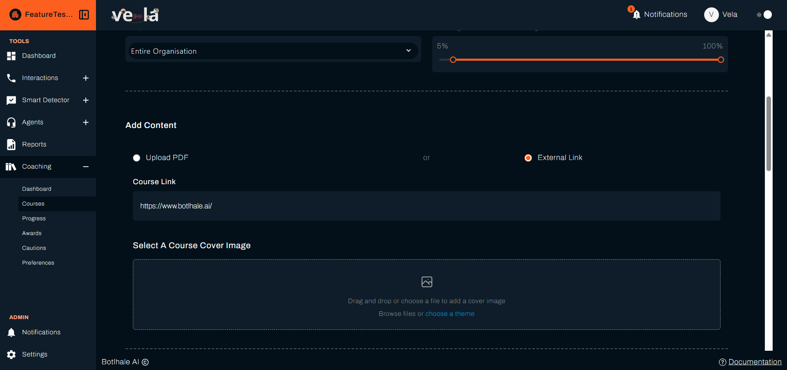
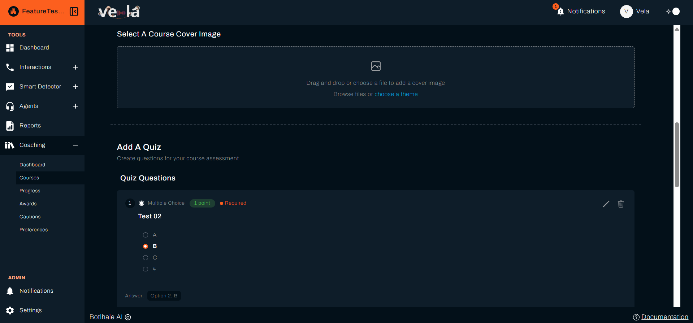
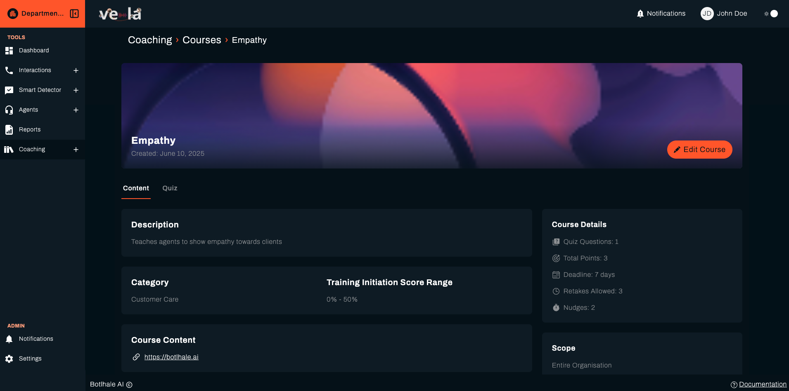
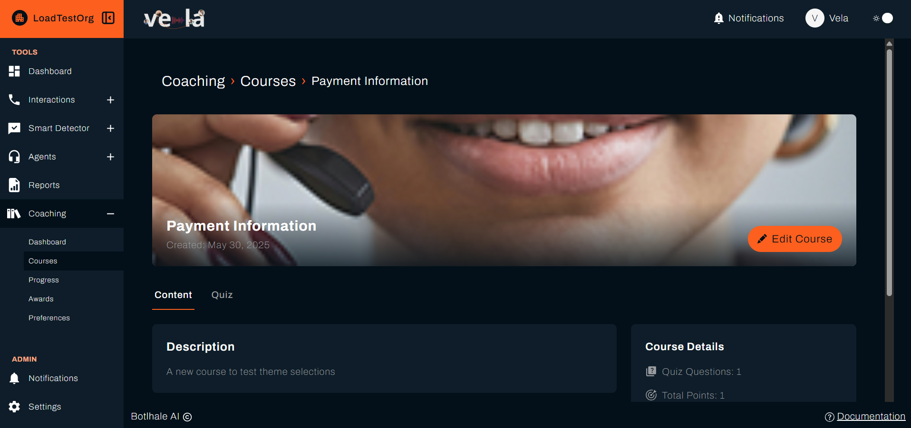
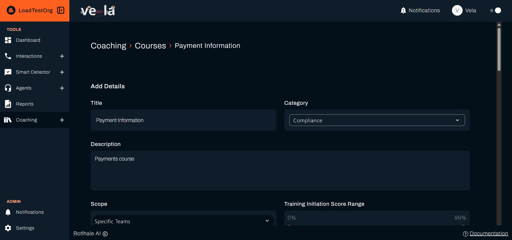

import Hotspots from '@site/src/components/Hotspots';
import newCourseImg from '@site/img/screenshots/team_lead/courses/new-course.png';
import retakesImg from '@site/img/screenshots/team_lead/courses/new-course4.png';

A course is training you build once and Vela assigns automatically. You set the category and the score range within it that assigns the course, and on each evaluation cycle every agent whose score in that category falls in the range receives it. Courses reach people by score rather than by name, so you set the criteria rather than picking individuals.

---

## Before You Begin

You need:

- **A gap worth training.** Build the course around a category several agents are behind in. See [Read the Coaching Dashboard](./coaching-dashboard.md).
- **Your material ready.** A file to upload, a link to point at, or both.
- **To know your evaluation cycle.** Assignment happens on the cycle set under Preferences, so a course created today reaches agents at the next run rather than immediately. See [Set Coaching Preferences](./coaching-preferences.md).

---

## 1. Open the Courses Page

Select **Coaching** in the left sidebar, then **Courses**. The page lists what already exists, so check whether a course covering this gap is already there before building another.

Select **Create a New Course** to start one.

---

## 2. Add Details

The form is one page in four labelled parts, and **Add Details** is the first.

<Hotspots
  src={newCourseImg}
  alt="The Add Details step of the course form: Title and Category above Description, then Scope and the Training Initiation Score Range slider"
  points={[
    { x: 23.1, y: 31.6, title: 'Title', body: 'The name of the course. It is the Course Title agents see in their list.' },
    { x: 65.2, y: 31.6, title: 'Category', body: 'The scorecard category the score range below is measured against, not only a label for browsing.' },
    { x: 26.4, y: 47.5, title: 'Description', body: 'What the course covers, and why it was assigned.' },
    { x: 24.1, y: 69.9, title: 'Scope', body: 'Whether the course can reach the whole organisation, chosen departments, or chosen teams.' },
    { x: 75.1, y: 69.9, title: 'Training Initiation Score Range', body: 'The band of scores that receives the course.' },
  ]}
/>

{/* When Cautions ships, add a line to the Category pin above: it also names what a caution counts failed courses against. Link issue-cautions.md. */}

A category is required, and saving without one is refused.

Write the description for the agent receiving it. "Improve compliance" says less than "Covers the disclosures required at the start of a call, and when each applies."

:::note There is no way to add a category from this form
Pick from the categories your organisation already has. There is no **+ Add New** control reachable here, so a new category has to be added elsewhere by whoever manages your Vela platform.
:::

### Scope

Choosing departments or teams reveals a selector for which ones, and the course is refused until you pick at least one. Your own access level caps what you may set here.

### Training Initiation Score Range

This is the setting that decides who receives the course, measured against the agent's score in the **Category** you chose above, not their overall score. It is a slider with two handles over 0 to 100, and the percentages either side of it show the floor and ceiling you have set. On each evaluation cycle, every agent in scope whose score in that category falls between them is assigned the course.

Set it around the gap you found on the Dashboard rather than around a pass percentage. A range of 0 to 100 assigns the course to everyone, so there is no comparison group to show whether it worked. A range of 40 to 65 reaches the people who are struggling with the thing this course teaches, and leaves a comparison group who did not need it.

The range is a band, not a threshold. An agent above the ceiling does not receive the course, which is deliberate: training aimed at a weakness is wasted on someone who does not have it.

Scope and the score range work together rather than instead of each other. Scope decides who is eligible at all. The range decides which of those people qualify on a given cycle.

---

## 3. Add Content

A course holds what the agent works through. **Upload PDF** and **External Link** are alternatives, with **or** between them, so a course carries one or the other rather than both.

- **Upload PDF**: drag and drop a file, or select the area to browse. The form states the rule beneath it: *Accepted file type: PDF. Maximum size: 10MB.* A file in any other format is refused, and one over the limit reports **File size exceeds 10MB limit**.
- **External Link**: reveals a **Course Link** field for a URL that opens elsewhere, for material you host outside Vela.

:::note PDF is the only accepted upload
The upload control accepts `.pdf` and nothing else. Where your material is a slide deck, a document, or a video, either export it to PDF or host it and point **External Link** at it.
:::

### Select A Course Cover Image

The cover image is what the agent sees against the course in their list. Drag one in, **Browse files**, or **choose a theme** to take one of the supplied images.

A theme image is enough for most courses. It costs nothing and still gives agents something to recognise the course by in a list.

---

## 4. Add A Quiz

Select **Add Question** for each question you want to ask. Every question needs its text and an answer type:

| Answer type | What the agent does | What you set |
| :--- | :--- | :--- |
| **Multiple Choice** | Picks one of the options | At least two options, and which is the **Correct Answer** |
| **Short Paragraph** | Writes a brief answer | The question, and the answer Vela judges it against |
| **Long Paragraph** | Writes at length | The question, and the answer Vela judges it against |

A multiple choice question is refused until it has at least two options and one of them is marked correct. Use **Add option** to build the list.

Paragraph answers still need a correct answer, typed rather than chosen. Vela compares the agent's answer against it and scores by meaning rather than exact wording. Write those questions so there is something specific to judge: "Name the two disclosures required before taking payment" can be scored, "What did you think of this course?" cannot.

Every question also carries **Points**, worth 1 by default and adjustable, though saving is refused if you set it to 0, and **Required**, a toggle set on by default that decides whether the agent must answer it before submitting the quiz.

Each question you add is listed with its number, its answer type, the point value and **Required** setting you gave it, and the **Answer** you marked correct. The **pencil** edits a question and the **bin** removes it.

{/* RESHOOT: this capture originally showed Support in the ADMIN section, an internal-only control that must never appear in a screenshot. Cropped out here as a temporary fix. Reshoot from a non-@botlhale.ai account when this page is next touched. */}

---

## 5. Set Retakes, Deadline and Nudges

These three sit together below the quiz, and they decide how much room an agent has to finish.

<Hotspots
  src={retakesImg}
  alt="Quiz Retakes, Deadline, and Set course nudges, each a control with its own info icon, stacked down the page"
  points={[
    { x: 31.1, y: 11.8, title: 'Quiz Retakes', body: 'How many retakes an agent gets after a first attempt, from 1 to 5. New courses start at 3, which allows four attempts in total.' },
    { x: 28.9, y: 27.6, title: 'Deadline', body: 'How long an agent has from the day the course is assigned to them, rather than a fixed date.' },
    { x: 33.6, y: 44.5, title: 'Set course nudges', body: 'A reminder sent to an agent who has not finished, counted back from the due date.' },
  ]}
/>

### Quiz Retakes

**Quiz Retakes** decides how long a struggling agent can keep trying before the course closes on them. Their **Initiation Score**, the score that qualified them for the course, stays visible throughout, so you can see whether the attempts moved it.

:::warning Complete does not mean passed
An agent reaches **Complete** by running out of retakes or by selecting **Complete Course**, whichever comes first, whatever they scored. The **Progress** table shows the same status either way, so read **Complete** together with **Score**. See [Metrics](../reference/metrics.md#course-progress) for what the two routes mean for what you do next.
:::

The pass percentage itself is set once for all courses under Preferences, not per course. See [Set Coaching Preferences](./coaching-preferences.md).

### Deadline

**Deadline** takes a count and a unit, and the unit is **Days**, **Weeks**, or **Months**. Each agent's **Due Date** is worked out from the day they receive it, so two agents who qualify on different cycles get the same amount of time rather than the same date.

### Set Course Nudges

You set each **nudge** as a count and a unit, so one of 2 **Days** reaches the agent two days before their deadline. Select **+** to add it.

Add up to three, and each appears as `2 days before deadline` with a control to remove it. Adding one that already exists is refused with **Nudge already exists**.

Because the deadline runs from the day each agent receives the course, nudges follow each agent's own due date rather than a shared calendar date.

Two nudges are usually enough: one with enough time left to do the work, and one close to the deadline. A course with none relies on the agent remembering.

---

## 6. Save the Course

Select **Create Course** to save, or **Close** to leave without saving. The course runs on your organisation's evaluation cycle set under [Coaching Preferences](./coaching-preferences.md). There is no per-course cycle to set separately.

---

## 7. Read a Course

Select a course in the list to open it. This is also what an agent sees, so it is worth checking after you save.

The banner carries the cover image, the course name and **Created**. **Content** and **Quiz** tabs split the material from the questions.

**Course Details** on the right summarises what you set on the form:

| Line | What it reports |
| :--- | :--- |
| **Quiz Questions** | How many questions the quiz holds |
| **Total Points** | What the quiz is worth in total |
| **Deadline** | The window each agent gets, counted from the day they receive it |
| **Retakes Allowed** | Attempts at the quiz |
| **Nudges** | How many reminders are set |

**Scope** sits beneath it, and **Course Content** holds the PDF or the link.

Read this page once after building a course. A quiz worth fewer points than you intended, or a nudge count of 0, is quicker to spot here than anywhere else.

---

## 8. Edit a Course

Open a course from the list and select **Edit Course**, in the banner, to change its details, material, or questions.

This opens the same form as building a course, pre-filled with what you set.

Editing changes the course for agents who have not yet completed it. Agents who already finished keep the result they earned.

---

## Check Your Work

The course appears in the list as soon as you save it. That confirms it exists, not that anyone has it.

To confirm assignment, open **Progress** after the next evaluation cycle and look for agents against this course. Nothing there before the cycle runs is expected rather than a fault. See [Track Learning Progress](./track-learning-progress.md).

---

## Related

- [Read the Coaching Dashboard](./coaching-dashboard.md): find the gap a course should target
- [Track Learning Progress](./track-learning-progress.md): see who has started, finished, or stalled
- [Set Coaching Preferences](./coaching-preferences.md): the cycle and pass percentage that govern courses
- [Recognise Good Work](./recognise-good-work.md): mark the improvement a course produces

## Need Help?

**Contact Support:** support@botlhale.ai
