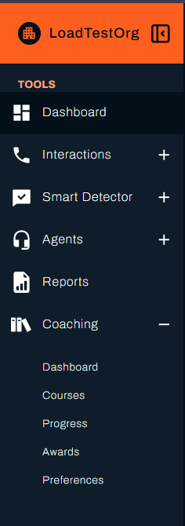

Coaching turns what Vela measures into training and recognition. You set the criteria once, and Vela assigns courses and presents awards to whoever meets them on a regular cycle. You are setting the rules rather than picking people each time.

This page takes you from an empty Coaching section to a first course that reaches the agents who need it. Work through it in order.

---

## Before You Begin

You need:

- **Coaching enabled for your organisation.** It is an add-on. Where it is enabled, **Coaching** appears in the left sidebar of the main Vela platform.
- **Processed interactions with scores.** Coaching works from scores, so agents need analysed interactions and a scorecard behind them.
- The **Organisational** access level, to set the preferences in step 1. Changing preferences also needs the admin role.

---

{/* RESHOOT: this capture originally showed Support in the ADMIN section, an internal-only control (@botlhale.ai accounts only, per STYLE_GUIDE.md) that must never appear in a screenshot. Cropped out here as a temporary fix. It also showed Cautions as a live Coaching item, which is unreleased (absent from vela's origin/main) and unexplained in this page's text; that inconsistency is not fixed by the crop. Reshoot from a non-@botlhale.ai account once Cautions ships, or crop it out too if it ships after this page does. */}

---

## 1. Set the Cycle First

Select **Coaching** in the left sidebar, then **Preferences**.

Set the [evaluation cycle](../reference/glossary.md#evaluation-cycle) before anything else. It decides how often Vela reviews scores and assigns what agents have qualified for, and nothing is assigned between runs. A course built without knowing the cycle looks broken for a month.

Set the **Pass Percentage** at the same time. It applies to every course you build afterwards.

See [Set Coaching Preferences](./coaching-preferences.md) for each setting, including what agents can see of their own work.

---

## 2. Find a Gap Worth Training

Select **Dashboard**.

Set the date range to a period with enough interactions to judge, then read **Category Scores**. Look for a category where several agents sit below the team rather than one agent below everywhere.

Several agents behind in one category is what a course fixes well. One agent behind everywhere is a conversation, not a course.

See [Read the Coaching Dashboard](./coaching-dashboard.md).

---

## 3. Build a Course Around It

Select **Courses**, then **Create Course**.

Name it for the gap, describe what it covers in terms the agent recognises, and attach your material. Add a quiz so completion means something. Set the **Deadline** in days and the scope.

The [**Training Initiation Score Range**](../reference/glossary.md#training-initiation-score-range) is what decides who receives it. Narrow it to the agents you saw behind in step 2. A wide range reaches everyone and measures nothing.

See [Create and Assign Courses](./create-and-assign-courses.md).

---

## 4. Wait for the Cycle, Then Check

Nothing happens until the next evaluation run. When it has passed, select **Progress**.

Confirm agents appear against your course with a **Date Assigned**. Nobody there means no agent's scores fell inside your **Training Initiation Score Range**, so widen it or check the scores again.

See [Track Learning Progress](./track-learning-progress.md).

---

## 5. Recognise the Improvement

Select **Awards**, then **Create Award**.

Set the **Agent Score** at a mark that means something when reached. Write the **Award Message** as though speaking to the person, because that is the part they read.

See [Recognise Good Work](./recognise-good-work.md).

---

## Check Your Work

You have finished the setup when four things are true:

- The evaluation cycle is set.
- One course exists, with a **Training Initiation Score Range** covering a real gap.
- **Progress** shows agents against that course, after a cycle has run.
- One award exists.

The most common first-week surprise is an empty **Progress** page. Before the first cycle runs that is expected rather than a fault.

---

## Related

- [Set Coaching Preferences](./coaching-preferences.md): the cycle, pass percentage, and agent view
- [Read the Coaching Dashboard](./coaching-dashboard.md): find the gap worth training
- [Create and Assign Courses](./create-and-assign-courses.md): build the training
- [Track Learning Progress](./track-learning-progress.md): confirm it reached people
- [Recognise Good Work](./recognise-good-work.md): mark the improvement

## Need Help?

**Contact Support:** support@botlhale.ai
