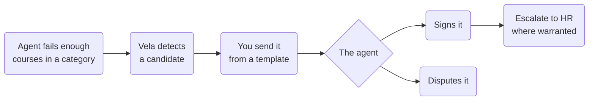
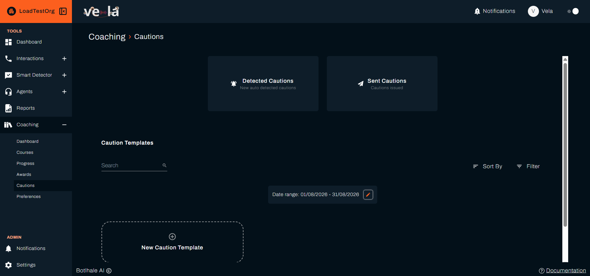
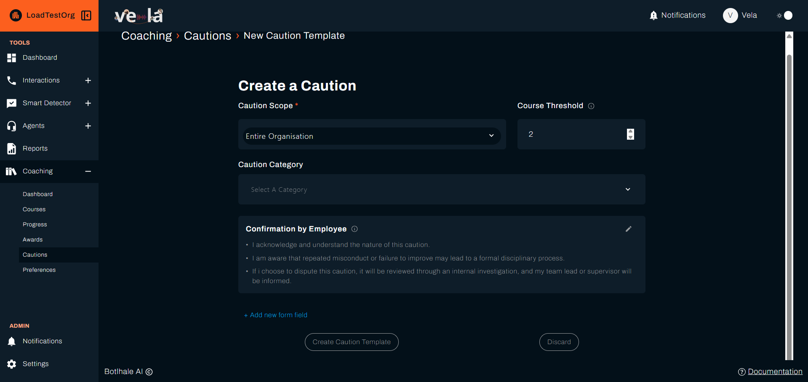
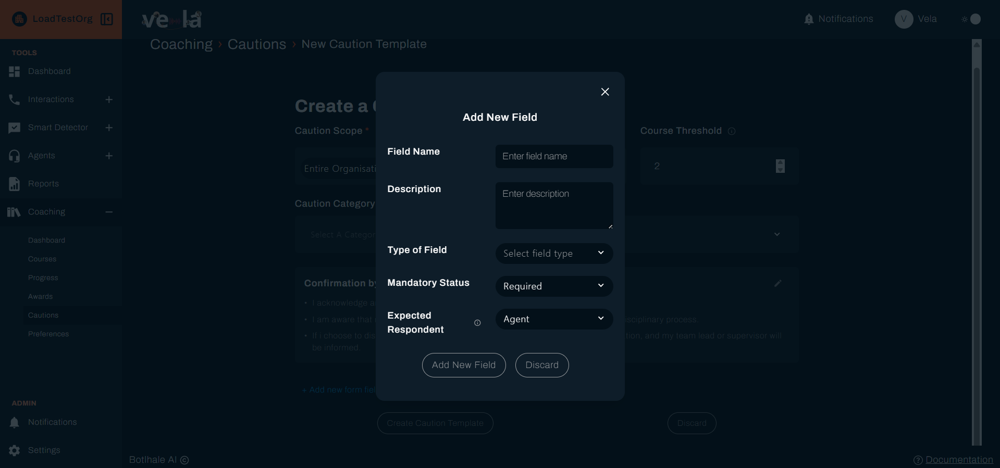

{/* DRAFT: Cautions is on the dev branch and not yet released. This page is set
    draft: true so it stays out of the published site. When Cautions ships,
    remove the draft flag, add the page to sidebars.js after coaching-preferences,
    fix the pagination on the page before it, and capture the screenshots marked below. */}

A caution is a formal record that an agent's performance has fallen below standard. Unlike a course or an award, which Vela presents on its own, a caution is only ever sent by a person. Vela finds the candidates and you decide which ones become a record.

A caution is triggered by **failed courses**, not by scores directly. Each caution template names a category and a **Course Threshold**, and an agent who fails that many courses in the category becomes a candidate. That places cautions at the end of the coaching path rather than alongside it: the agent was assigned training, the training did not work, and the formal record follows.

The sequence is the same every time: Vela detects a candidate, you send it from a template, the agent acknowledges it, and you escalate to HR where that is warranted.

---

## Before You Begin

You need:

- **A caution template for the category.** Sending a caution builds it from a template held against the category it was raised in. Without one, sending is refused with **No caution template found for this warning**. Create the templates before you need them, because the moment you want to send a caution is not the moment to start writing one.
- **Courses that agents have failed.** Detection counts failed courses in a category against the template's **Course Threshold**, so an organisation not yet assigning courses produces no candidates.
- **Somewhere for escalations to go.** Escalating asks for the email addresses that receive it. Agree who those are with HR first.

---

## 1. Find the Candidates

Select **Coaching** in the left sidebar, then **Cautions**.

Two cards sit at the top and the templates sit below them:

| Section | What it holds |
| :--- | :--- |
| **Detected Cautions** | New auto detected cautions, which are candidates Vela has found and nobody has acted on |
| **Sent Cautions** | Cautions issued, which are the records already sent to an agent |
| **Caution Templates** | The wording each caution is built from, with its own **Search**, **Sort By**, **Filter** and date range |

Open **Detected Cautions**. Each row is a candidate:

| Column | What it shows |
| :--- | :--- |
| **Name** | The agent |
| **Category** | The category whose failed courses reached the threshold |
| **Date Detected** | When Vela raised it |
| **Action** | **Send Caution**, which opens the send form |
| **View** | Opens the full detail behind the candidate |

Set the **Date range** above the table to the period you are reviewing. **Search** finds an agent by name, and **Sort By** and **Filter** narrow the rest. Long lists are paged, with **Previous** and **Next** either side of **Page 1 of 2**.

A candidate is not a caution. Nothing reaches the agent until you send it, so a list you have not worked through has no effect on anyone.

---

## 2. Check Before You Send

Select **View** on a row before sending. The detail page shows **Agent Information** and **Caution Details**, including the category scores the detection was based on.

Read what is behind the detection rather than the fact of it. Detection is a threshold being crossed, and a threshold does not know whether the agent was newly assigned to the work, covering an unfamiliar queue, or dealing with a run of unusual interactions. A caution you cannot justify from what is in front of you is one to leave unsent.

Because detection already means courses were failed, the coaching route has usually been tried. Check that it was tried properly: a course assigned with an unrealistic deadline, or one whose material never matched the gap, is a failure of the course rather than of the agent.

---

## 3. Send the Caution

Select **Send Caution** on the row. The form shows:

- **Category** and **Score**, so you can confirm what the caution is for.
- **Category Scores**, loaded for that agent.
- **Caution Message from Template**, the wording that will reach the agent.
- **Complete Required Information**, where you fill in whatever the template leaves open.

Fill in the required information and select **Send Caution**. You get **Caution sent successfully**, and the record moves to **Sent Cautions**.

Anything you type here becomes part of a formal record the agent signs. Write it as though it will be read back to you by someone who was not there, because that is the situation it exists for.

---

## 4. Track What You Have Sent

Open **Sent Cautions**. Each row is a record that has already reached an agent:

| Column | What it shows |
| :--- | :--- |
| **Name** | The agent |
| **Category** | What the caution was raised for |
| **Agent Status** | **Pending**, **Signed**, or **Disputed** |
| **Date Delivered** | When it reached the agent |
| **Date Signed** | When they signed it, or **Not signed** |
| **Action** | **Download**, which gives you the caution as a PDF |
| **Send to HR** | Escalates it, and reads **Sent to HR** once it has been |

**Agent Status** is the column to work from:

| Status | What it means and what to do |
| :--- | :--- |
| **Pending** | Delivered but not acknowledged. Chase it, as an unsigned caution is a weak record |
| **Signed** | The agent has acknowledged it. Nothing further is needed unless you are escalating |
| **Disputed** | The agent disagrees. Deal with it directly before anything else happens to the record |

A caution sitting at **Pending** with an old **Date Delivered** is the one to act on. It means a formal step was started and never finished.

---

## 5. Escalate to HR

Select **Send to HR** on a row. The form asks for the email addresses that should receive it, and **Save this address?** keeps one for next time so you are not retyping it on every escalation.

Enter at least one address, or you get **Please enter at least one email address**. Addresses are checked as you go, and a malformed one is refused with **Please enter valid email addresses**.

Select **Send Caution to HR**. The caution goes out as a PDF attachment, and the row reads **Sent to HR** afterwards.

:::caution Escalation cannot be undone
The email leaves Vela as soon as you send it, and there is no recall. Check the addresses and the agent's status before you select it, as escalating a caution the agent is still disputing puts an unresolved disagreement in front of HR as though it were settled.
:::

---

## 6. Manage the Templates

A template does two jobs: it decides **when** a caution is detected, and it supplies **what** the agent reads. Nothing works until one exists for the category, so build these first.

Open **Caution Templates** and select **New Caution Template**.

| Field | What it does |
| :--- | :--- |
| **Caution Scope** | Required. Whether the template covers the whole organisation, a department, or a team |
| **Course Threshold** | How many courses an agent must fail in the category before a caution is detected. The lowest you may set is 2 |
| **Caution Category** | The category the template serves. Failed courses are counted within it |
| **Confirmation by Employee** | The statements the agent agrees to when they sign. Select the **pencil** to change the wording |

Select **Create Caution Template** to save, or **Discard** to leave without saving. A template with no name set reads **Untitled Caution** in the list.

:::note Why the threshold starts at 2
Setting it to 1 is refused with **Course threshold must be at least 2 to prevent false positives**. One failed course is a normal part of coaching, so a formal record should not follow from it.
:::

### Adding Your Own Fields

**Add new form field** puts an extra question on the caution, for anything your process needs recording that the standard wording does not cover.

| Field | What it does |
| :--- | :--- |
| **Field Name** | What the field is called on the caution |
| **Description** | Guidance for whoever fills it in |
| **Type of Field** | What kind of answer it takes |
| **Mandatory Status** | **Required** or otherwise. A required field has to be completed before the caution can be sent |
| **Expected Respondent** | Who answers it, such as the **Agent** |

**Expected Respondent** is the field to get right. It decides whether the question is one you answer when sending, or one the agent answers when they acknowledge, and a question aimed at the wrong person blocks the step that person is trying to complete.

Add the field with **Add New Field**, or leave with **Discard**.

Keep one template per category you actually caution on. Sending fails outright where a category has no template, so a gap here is discovered at the worst possible moment.

---

## Check Your Work

The caution appears in **Sent Cautions** with a **Date Delivered**. That confirms it reached the agent, not that they have seen it.

To confirm the loop closed, check that **Agent Status** has moved to **Signed** and that **Date Signed** holds a date. A caution that stays **Pending** has been delivered to someone who has not opened it.

---

## Related

- [Create and Assign Courses](./create-and-assign-courses.md): the coaching route to try before a caution
- [Read the Coaching Dashboard](./coaching-dashboard.md): the category scores detection works from
- [Coaching Preferences](./coaching-preferences.md): the evaluation cycle that decides how often detection runs

---

## Need Help?

**Contact Support:** support@botlhale.ai
