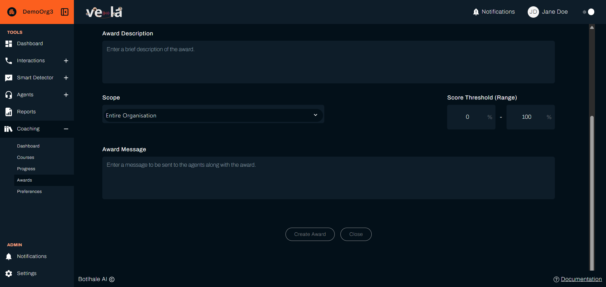
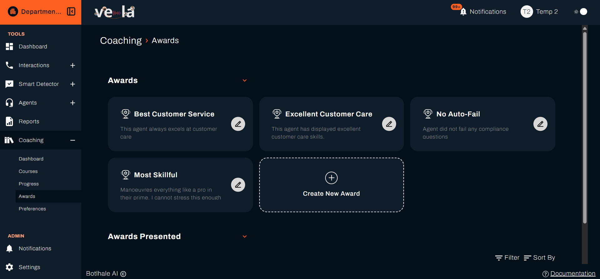
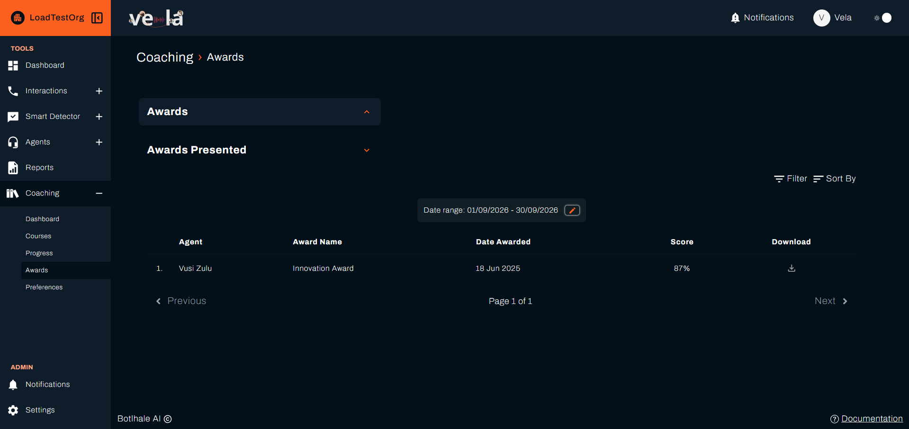

import Hotspots from '@site/src/components/Hotspots';
import createAwardImg from '@site/img/screenshots/team_lead/awards/create-award.png';

An award is recognition you define once and Vela presents automatically. You set what earns it, and on each evaluation cycle every agent who meets the criteria receives it with a certificate. Like courses, awards reach people by score rather than by name.

---

## Before You Begin

You need:

- **Something worth recognising.** An award for a mark most of the team already clears recognises nothing. Set it where reaching it means something.
- **To know your evaluation cycle.** Awards are presented on the cycle set under Preferences, so one created today reaches agents at the next run. See [Set Coaching Preferences](./coaching-preferences.md).

---

## 1. Create an Award

Select **Coaching** in the left sidebar, then **Awards**. Select **Create New Award** to open the form. The form takes its fields in this order:

<Hotspots
  src={createAwardImg}
  alt="The Create an Award form: Award Name and Award Category above Award Description, then Scope and the Score Threshold (Range) Min and Max fields"
  points={[
    { x: 28.8, y: 42.2, title: 'Award Name', body: 'What the award is called, on the certificate and in the agent\'s list.' },
    { x: 68.4, y: 42.2, title: 'Award Category', body: "The scorecard category the score threshold below is measured against. The list is the same one your organisation's scorecard questions are grouped into." },
    { x: 31.4, y: 59.6, title: 'Award Description', body: 'What the award recognises.' },
    { x: 25.9, y: 81.5, title: 'Scope', body: 'Whether the award covers the whole organisation, chosen departments, or chosen teams.' },
    { x: 91.5, y: 81.5, title: 'Score Threshold (Range)', body: 'The Min and Max an agent\'s score in that category must fall between to earn it.' },
  ]}
/>

The form is one page, scrolled. **Award Message**, what the agent reads when it is presented to them, sits below the fields above, with **Create Award** to save it and **Close** to leave without saving.

Every award runs on your organisation's evaluation cycle, set under [Coaching Preferences](./coaching-preferences.md). There is no per-award cycle to set separately.

**Score Threshold (Range)** is a range rather than a single mark. An agent earns the award when their score in **Award Category** falls between **Min** and **Max**, the same mechanism a course uses, aimed at a high band instead of a low one.

That lets you recognise a tier rather than everyone above a line. A "top performer" award is a high min with a max of 100 on the category that matters most. A band such as 70 to 79 picks out that group on its own.

{/* SCREENSHOT NEEDED: the Scope control expanded to departments or teams, with the multi-select open and the "N departments selected" count beneath it. Suggested path: img/screenshots/team_lead/awards/create-award-scope.png */}

**Scope** decides who is eligible. Choosing departments or teams reveals a second selector for which ones, and the form reports how many you have picked. What you may set is limited by your own access level: departmental access cannot award outside your department.

Write the **Award Message** as though speaking to the person. It is the part they actually read, and a specific sentence about what they did well is worth more than a generic congratulation.

---

## 2. See What Has Been Presented

The Awards page holds two collapsible sections: **Awards**, which is what you have defined, and **Awards Presented**, which is what has actually gone out.

Open **Awards Presented**. Each row is one award reaching one agent:

| Column | What it shows |
| :--- | :--- |
| **Agent** | Who received it |
| **Award Name** | Which award |
| **Date Awarded** | When the evaluation cycle presented it |
| **Score** | The score they held when it was presented |
| **Download** | Saves the certificate |

**Filter**, **Sort By**, and the date range sit above the list, and long lists are paged with **Previous** and **Next**.

An empty list where you expected awards usually means the date range, not a fault. Awards are presented on the evaluation cycle, so a range that predates the last run shows nothing.

{/* RESHOOT: this capture still shows Support in the ADMIN section behind the dimmed backdrop, an internal-only control that must never appear in a screenshot. Painted over as a temporary fix rather than cropped, since the modal is wide enough that cropping clipped its own content. Reshoot from a non-@botlhale.ai account when this page is next touched — see filter.png above, which already got a clean recapture. */}

---

## 3. Download a Certificate

Select the **download** icon in the **Download** column to save that agent's certificate. It carries:

| Field | What it shows |
| :--- | :--- |
| Name | The agent's |
| Category and score | The award's category and the agent's score, not the award's own name |
| Description | What the award recognises |
| Supervisor | Your name |
| Period | A date range, not a single date |

Agents can download their own certificates from their portal, so this is for your records rather than for sending to them. See [View Your Awards](../agents/your-awards.md).

---

## 4. Edit an Award

Select the **pencil** icon on the award's card, in the **Awards** section, to change its details, its scope, or the score range that earns it.

Changing the range changes who qualifies from the next evaluation cycle on. Awards already presented stay presented.

---

## Check Your Work

The award appears in the list as soon as you save it. That confirms it exists, not that anyone has earned it.

To confirm it is being presented, open **Awards Presented** after the next evaluation cycle. Nothing there before the cycle runs is expected. An award nobody earns after several cycles usually means the **Score Threshold (Range)** sits above what the team reaches, or that its **Min** and **Max** enclose too narrow a band.

---

## Related

- [Read the Coaching Dashboard](./coaching-dashboard.md): the scores awards are set against
- [Create and Assign Courses](./create-and-assign-courses.md): training that lifts agents towards them
- [Set Coaching Preferences](./coaching-preferences.md): the cycle that presents awards
- [View Your Awards](../agents/your-awards.md): what the agent sees when one arrives

## Need Help?

**Contact Support:** support@botlhale.ai
