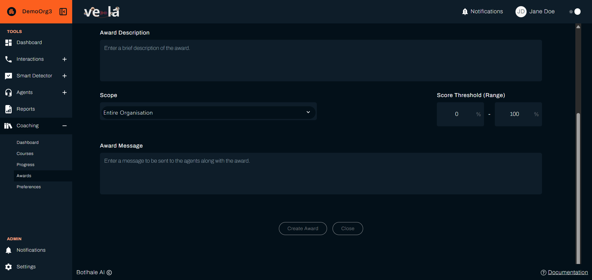
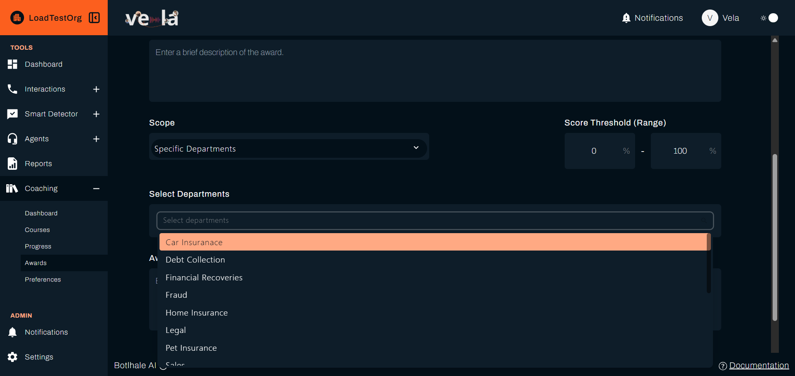
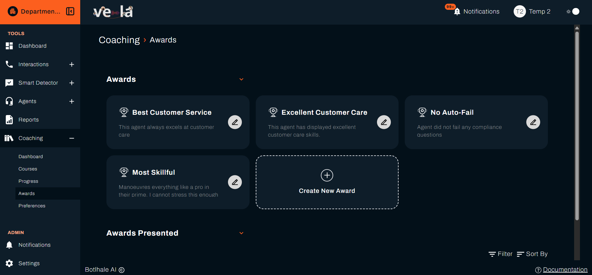
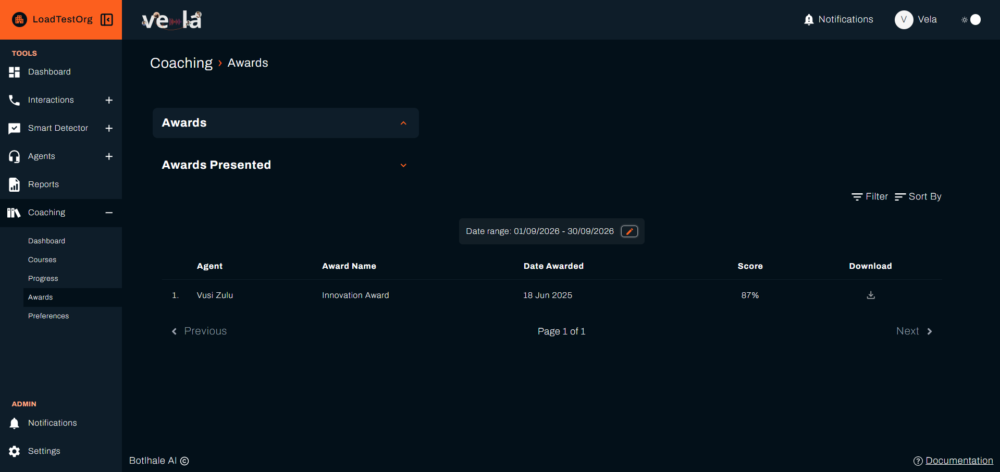
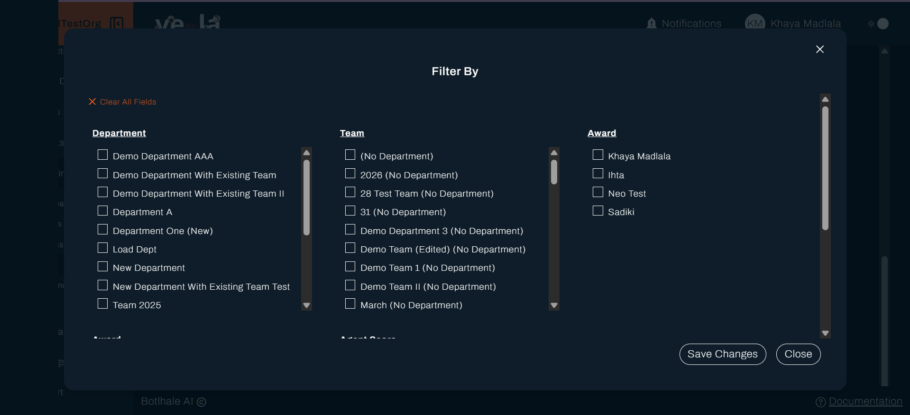
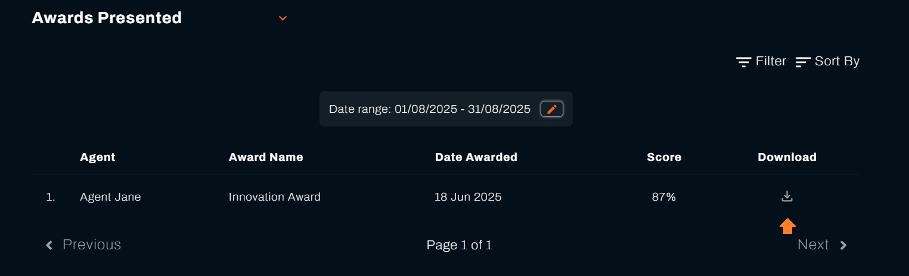
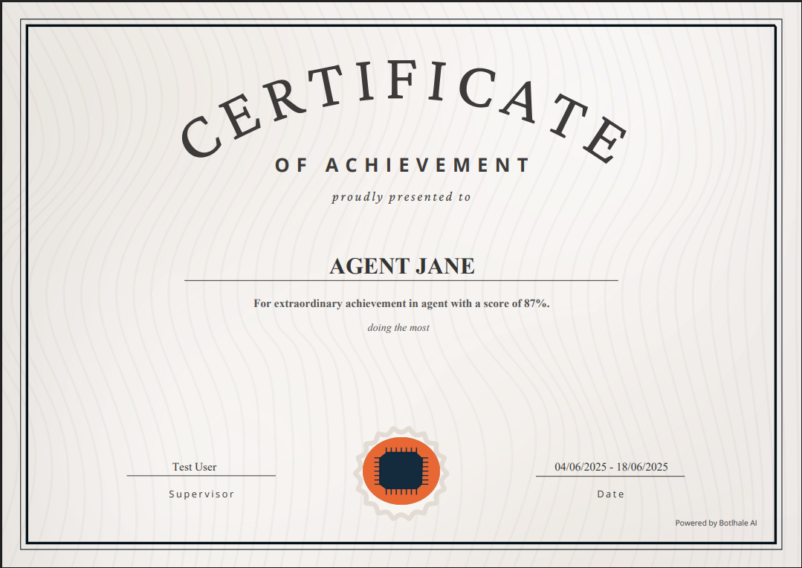
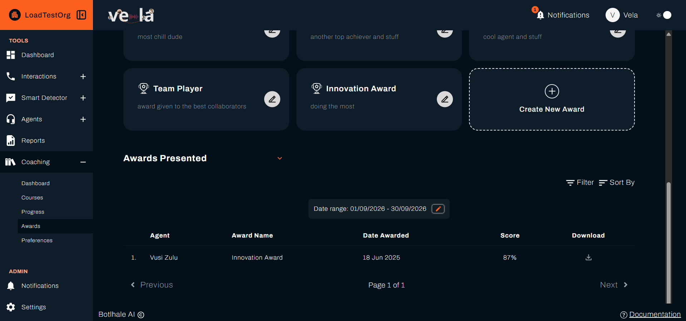

import Hotspots from '@site/src/components/Hotspots';
import createAwardImg from '@site/img/screenshots/team_lead/awards/create-award.png';

An award is recognition you define once, as a team lead, and Vela presents automatically. You set what earns it, and on each evaluation cycle every agent who meets the criteria receives it with a certificate. Like courses, awards reach people by score rather than by name.

{/* VERIFIED 2026-09-21 against origin/dev (lib/coachingCycle.js, #842), rechecked 2026-10-01 on origin/dev-hold. Not yet on origin/main or origin/vela-fly, which have no code that presents awards or assigns courses. Documented ahead of release by decision, 2026-10-01: main is expected to carry it before these pages go live. Full note under Award in glossary.md. */}

---

## Before You Begin

You need:

- **Something worth recognising.** An award for a mark most of the team already clears recognises nothing, and agents work out quickly that it is automatic. Check where scores actually sit on the [Coaching Dashboard](./coaching-dashboard.md) first, then set the floor above most of the team.
- **To know your evaluation cycle.** Awards go out on the cycle set under [Coaching Preferences](./coaching-preferences.md), not the moment you save the form. An award created today reaches nobody until that cycle runs, so check the cycle before you promise anyone a date.

---

## 1. Create an Award

Select **Coaching** in the left sidebar, then **Awards**. Select **Create New Award** to open the form. The form takes its fields in this order:

<Hotspots
  src={createAwardImg}
  alt="The Create an Award form, with Award Name and Award Category above Award Description, then Scope and the Score Threshold (Range) Min and Max fields"
  points={[
    { x: 28.8, y: 42.2, title: 'Award Name', body: 'What the award is called. It shows in the agent\'s own Awards list, but not on the certificate, which prints the award\'s category and score instead.' },
    { x: 68.4, y: 42.2, title: 'Award Category', body: "The scorecard category this award is about. The Score Threshold below is measured against the agent's score in it. Choose from the same categories your organisation's scorecard questions are grouped into." },
    { x: 31.4, y: 59.6, title: 'Award Description', body: 'What the award recognises. The agent sees it in their award list, and it prints on the certificate beneath the category and score.' },
    { x: 25.9, y: 81.5, title: 'Scope', body: 'Whether the award applies organisation-wide, or only to chosen departments or teams.' },
    { x: 91.5, y: 81.5, title: 'Score Threshold (Range)', body: 'The lowest and highest score that earn the award. It is measured against the agent\'s score in the chosen Award Category.' },
  ]}
/>

The form is one page, scrolled. **Award Message**, what the agent reads when it is presented to them, sits below the fields above, with **Create Award** to save it and **Close** to leave without saving.

Every award runs on your organisation's evaluation cycle, set under [Coaching Preferences](./coaching-preferences.md). There is no per-award cycle to set separately.

{/* UNVERIFIED: origin/dev-hold adds a Custom Evaluation Cycle checkbox to the award form (AwardCreateForm.jsx, AwardEditForm.jsx). coachingCycle.js uses it as that award's look-back window, while the organisation's cycle still decides when the run happens. Not on main or vela-fly. Needs a decision on whether to document it with the cycle. */}

**Score Threshold (Range)** is a range rather than a single mark. An agent earns the award when their score in **Award Category** falls between **Min** and **Max**. It works like a course's range, but aimed at high scores. The form opens at 0 and 100, which it refuses, because a range covering every score recognises no one. Set **Min** below **Max**, and keep the band narrower than 0 to 100.

That lets you recognise a tier rather than everyone above a line. A "top performer" award is a high min with a max of 100 on the category that matters most. A band such as 70 to 79 picks out that group on its own.

{/* UNVERIFIED: the per-Category measurement. The only implementation, lib/coachingCycle.js on origin/dev and origin/dev-hold (#842, rechecked 2026-10-01), uses the agent's overall score and never reads Category. Full note under Category in glossary.md. Needs the product owner to decide which is intended. */}

**Scope** decides who is eligible. Choosing departments or teams reveals a second selector for which ones, and the form reports how many you have picked. What you may set is limited by your own access level. Departmental access cannot award outside your department.

{/* UNVERIFIED: team access. On origin/vela-fly AwardCreateForm.jsx starts scope at "organisation" for every access level and, for team access, only shows the text "Applying course to: <team>" without changing it. The create route accepts organisation, and coachingCycle.js on dev-hold then takes in the whole organisation. So a team-access award may reach the whole organisation. Needs the product owner. */}

Write the **Award Message** as though speaking to the person. It is the part they actually read, and a specific sentence about what they did well is worth more than a generic congratulation.

---

## 2. See What Has Been Presented

The Awards page holds two collapsible sections. **Awards** is what you have defined, and **Awards Presented** is what has actually gone out.

Scroll down to **Awards Presented**, which is already open. Each row is one award reaching one agent:

| Column | What it shows |
| :--- | :--- |
| **Agent** | Who received it |
| **Award Name** | Which award |
| **Date Awarded** | When the evaluation cycle presented it |
| **Score** | The score they held when it was presented |
| **Download** | Saves the certificate |

**Filter**, **Sort By**, and the date range sit above the list, and long lists are paged with **Previous** and **Next**.

{/* CHECKED 2026-10-01: described as origin/dev-hold behaves, because this list fills only once the evaluation cycle ships from there. On origin/vela-fly (and main), Previous and Next throw (presentedAwardsTable.jsx uses an undeclared pathname), and the agent, team, department, and award filters return nothing (awards/page.jsx matches profile.* and checks awards against the agent list). dev-hold fixes both. Recheck when the cycle reaches main. */}

An empty list where you expected awards usually means the date range ends before the last run, not a fault. Awards are presented on the evaluation cycle, so widen the range first.

**Filter** opens **Filter By**, shown below. **Sort By** and the date range open the same panels as on **Progress**, described in [Track Learning Progress](./track-learning-progress.md#2-narrow-the-list).

---

## 3. Download a Certificate

Select the **download** icon in the **Download** column to save that agent's certificate. It carries:

| Field | What it shows |
| :--- | :--- |
| Name | The agent's name |
| Category and score | The award's category and the agent's score, not the award's own name |
| Description | What the award recognises |
| Supervisor | Whoever created the award, which is not always the person downloading it |
| Date | The dates the score covers, shown as a range rather than one day |

Agents can download their own certificates from their portal, so this is for your records rather than for sending to them. See [View Your Awards](../agents/your-awards.md).

---

## 4. Edit an Award

Select the **Pencil** icon on the award's card, in the **Awards** section, to change its details, its scope, or the score range that earns it.

Changing the range changes who qualifies from the next evaluation cycle on. Awards already presented stay presented.

---

## Check Your Work

The award appears in the list as soon as you save it. That confirms it exists, not that anyone has earned it.

To confirm it is being presented, open **Awards Presented** after the next evaluation cycle. Nothing there before the cycle runs is expected. An award nobody earns after several cycles usually means the **Score Threshold (Range)** sits above what the team reaches, or that its **Min** and **Max** enclose too narrow a band. Check its **Scope** too, in case it leaves out the agents who would qualify.

---

## Related

- [Read the Coaching Dashboard](./coaching-dashboard.md): the scores awards are set against
- [Create and Assign Courses](./create-and-assign-courses.md): training that lifts agents towards them
- [Set Coaching Preferences](./coaching-preferences.md): the cycle that presents awards
- [View Your Awards](../agents/your-awards.md): what the agent sees when one arrives

## Need Help?

**Contact Support:** support@botlhale.ai
