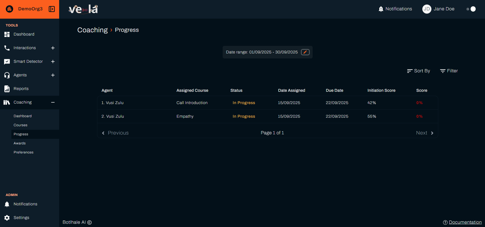
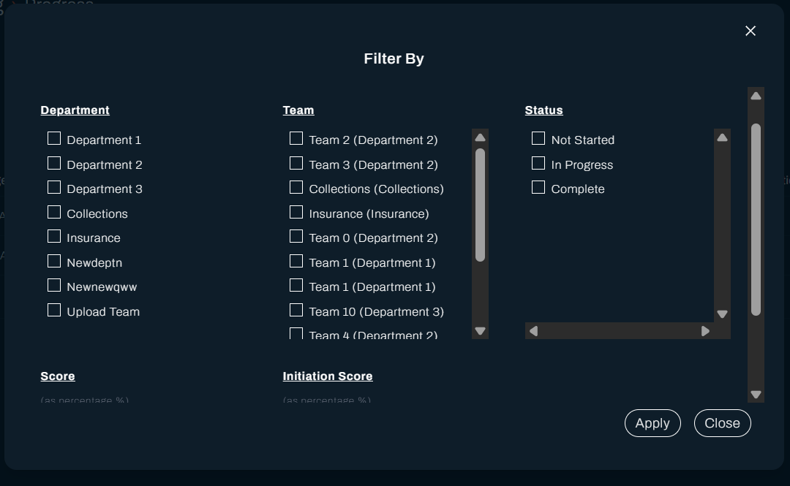
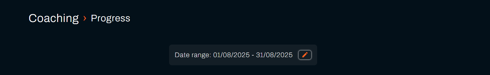
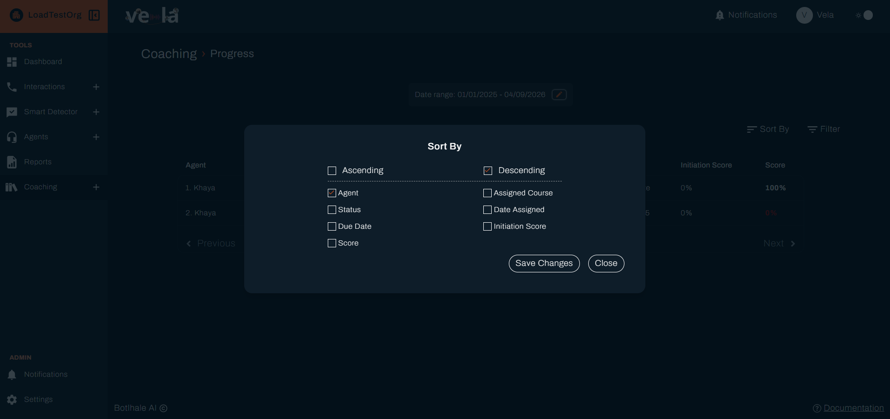

**Progress** shows where each agent is with the courses assigned to them. Use it to find the agents who have stalled, and to check whether a course you built is actually being completed.

---

## Before You Begin

You need:

- **Courses assigned.** Assignment happens on the evaluation cycle, so a course created since the last run has nobody against it yet. See [Create and Assign Courses](./create-and-assign-courses.md).
- **Access covering the agents.** Your access level decides which agents appear.

---

## 1. Read the List

Select **Coaching** in the left sidebar, then **Progress**. Each row pairs an agent with a course:

| Column | What it shows |
| :--- | :--- |
| **Agent** | Who the course was assigned to |
| **Assigned Course** | Which course |
| **Status** | **Not Started**, **In Progress**, or **Complete**, colour-coded red, amber and green |
| **Date Assigned** | When they received it |
| **Due Date** | Worked out from the deadline set on the course |
| [**Initiation Score**](../reference/glossary.md#initiation-score) | The agent's score at the time the course was assigned, which is the score that put them inside the course's **Training Initiation Score Range** |
| **Score** | Their result on the quiz. Reads **0%** by default until the agent submits it, so a 0% on a **Not Started** or **In Progress** row means no attempt yet, not a fail |

The two score columns sit side by side so you can read them together. **Initiation Score** is where the agent was before the course, and **Score** is how they did on it. A course assigned at 40% and passed at 90% tells you the assignment was aimed correctly.

**Score** is shown in red whenever it is below the **Pass Percentage** set in [Coaching Preferences](./coaching-preferences.md), including the default 0% on a course nobody has finished yet. Check **Status** alongside it before reading a red score as a fail: red on a **Complete** row is a real fail, red on **Not Started** or **In Progress** is the unfinished default rather than a result.

Long lists are paged, with **Previous** and **Next** either side of the page count.

:::note A status reading **Unknown**
A row occasionally shows **Unknown** rather than one of the three statuses. The assignment is real and the rest of the row is accurate. Treat it as **Not Started** until the agent opens the course, and report it if it persists.
:::

---

## 2. Narrow the List

**Filter** opens **Filter By**, which narrows the list on:

| Field | What it takes |
| :--- | :--- |
| **team** and department | Tick the teams whose agents you want, grouped under their department. A department with no name set reads **No Department** |
| **Status** | **Not Started**, **In Progress**, or **Complete** |
| **Score** | A range, so you can isolate the agents who failed |
| **Initiation Score** | A range, so you can isolate the agents a course was aimed at |

Select **Apply** to use them, and you get **Filters applied successfully**. Clearing them gives **Filters cleared successfully**.

There is no filter on an individual agent or a single course. Narrow by team and status, then sort, rather than searching for one name.

The date range is a separate control, the **pencil** icon above the table rather than part of **Filter By**. Selecting it opens its own picker with its own **Apply**.

The picker keeps the earlier date you click as the start automatically, so there is no way to set an out-of-order range. Where the page instead shows **Invalid date range**, one of the two dates has not been set yet.

**Sort By** orders the list on a column you choose.

---

## 3. Act on What You Find

| What you see | What it usually means |
| :--- | :--- |
| **Not Started** past the **Due Date** | The agent has not opened it. A direct reminder works better than waiting |
| **In Progress** for a long time | The material may be longer than the deadline allows, or the quiz is unclear |
| **Complete** with a low **Score** | The course ran but did not land. Check the material before assigning more |
| Everyone **Complete** with high scores | The course is working, or the pass percentage is set too low to tell |

:::tip Sort by Due Date to find who needs chasing
Sorting on **Due Date** brings the overdue to the top. Working from that list takes less time than reading the whole page, and it catches the agents a course is failing rather than the ones it is working for.
:::

---

## Check Your Work

Open **Progress** and confirm the course you assigned has agents against it, with **Date Assigned** on or after the evaluation cycle that ran.

A course with nobody against it after a cycle has run usually means no agent's scores fell inside its **Training Initiation Score Range**. Widen the range on the course, or check the scores on the Dashboard.

---

## Related

- [Create and Assign Courses](./create-and-assign-courses.md): build the courses tracked here
- [Read the Coaching Dashboard](./coaching-dashboard.md): whether scores moved after the training
- [Set Coaching Preferences](./coaching-preferences.md): the cycle that assigns courses
- [Recognise Good Work](./recognise-good-work.md): mark the improvement when it arrives

## Need Help?

**Contact Support:** support@botlhale.ai
