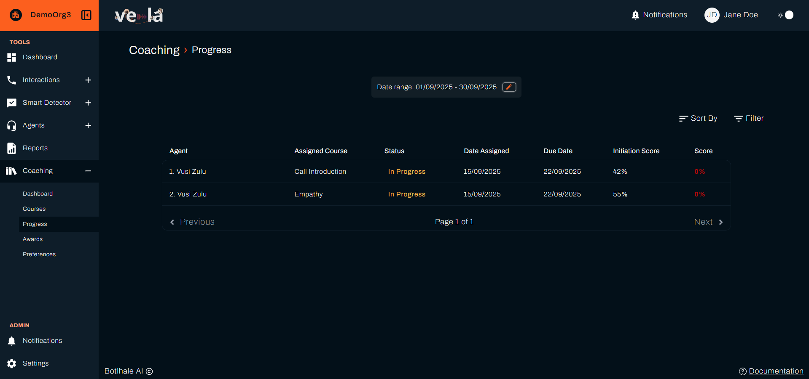
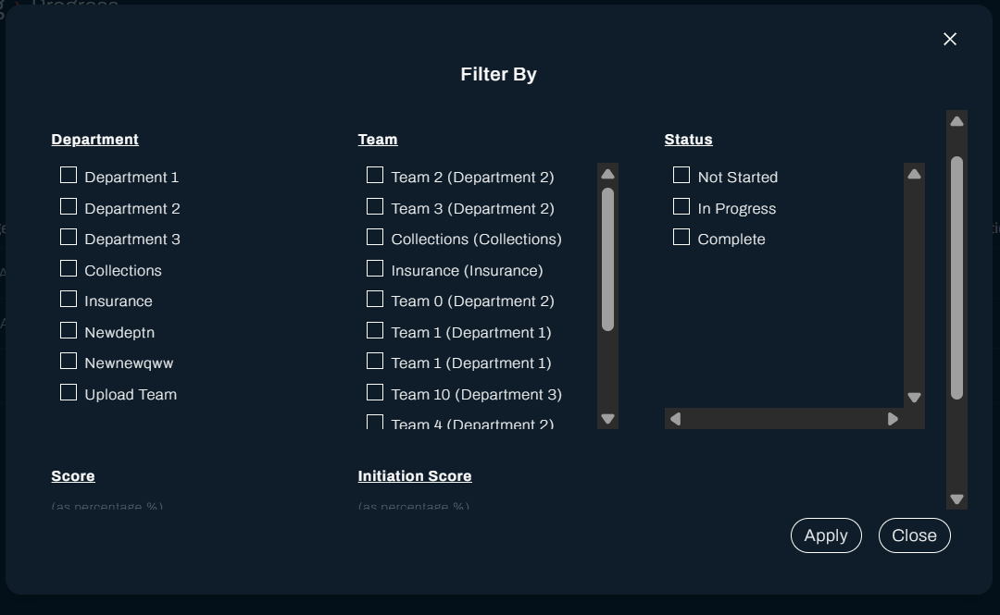
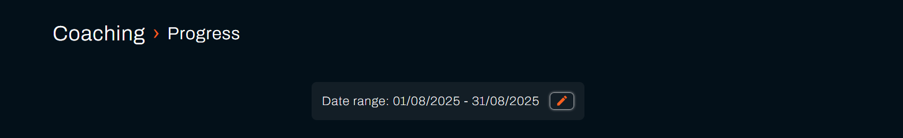
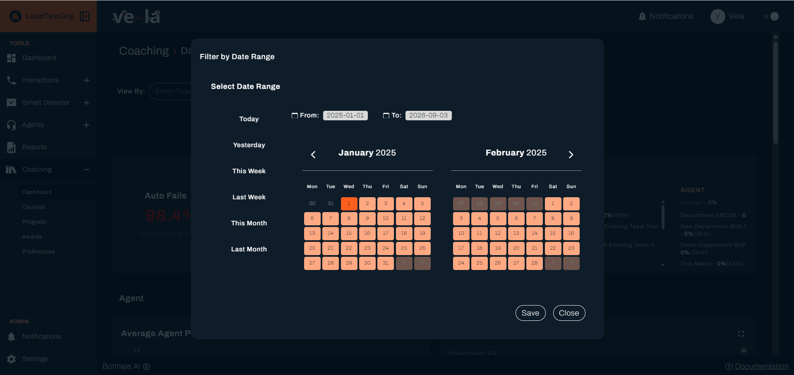
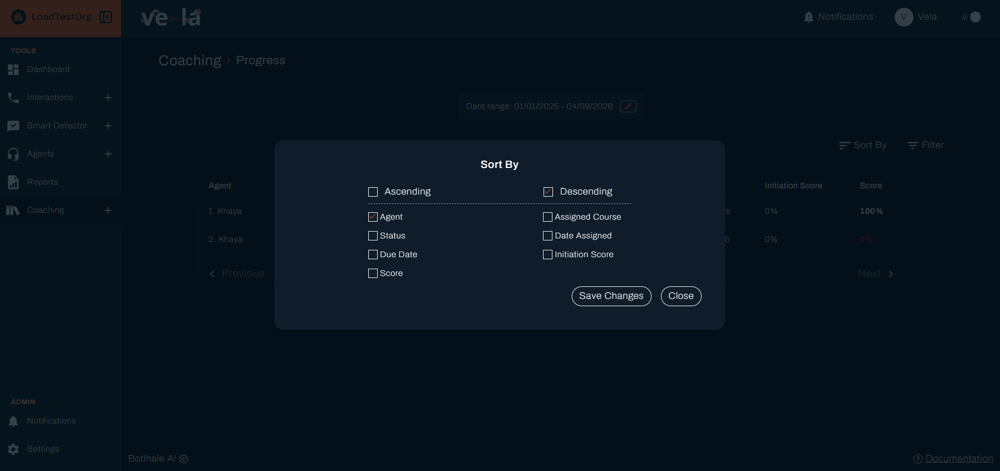

**Progress**, under **Coaching** in the main Vela platform, shows team leads where each agent is with the courses assigned to them. Use it to find the agents who have stalled, and to check whether a course you built is actually being completed.

---

## Before You Begin

You need:

- **Courses assigned.** Assignment happens on the evaluation cycle, so a course created since the last run has nobody against it yet. See [Create and Assign Courses](./create-and-assign-courses.md).
- **Access covering the agents.** Your access level decides which agents appear.

---

## 1. Read the List

Select **Coaching** in the left sidebar, then **Progress**. The list opens on courses assigned this month, so change the dates with the **Pencil** to see earlier ones. Each row pairs an agent with a course:

| Column | What it shows |
| :--- | :--- |
| **Agent** | Who the course was assigned to |
| **Assigned Course** | Which course |
| **Status** | **Not Started**, **In Progress**, or **Complete**, colour-coded red, amber and green |
| **Date Assigned** | When they received it |
| **Due Date** | Worked out from the deadline set on the course |
| [**Initiation Score**](../reference/glossary.md#initiation-score) | The agent's score at the time the course was assigned, which is the score that put them inside the course's **Training Initiation Score Range** |
| **Score** | Their result on their most recent quiz attempt. Reads **0%** until they submit, and again while they work on a retake, so a 0% on a **Not Started** or **In Progress** row is not a fail |

The two score columns sit side by side so you can read them together. **Initiation Score** is where the agent was before the course, and **Score** is how they did on it. A course assigned at 40% and passed at 90% tells you the assignment was aimed correctly.

**Score** is shown in red whenever it is below the **Pass Percentage** set in [Coaching Preferences](./coaching-preferences.md), including the 0% shown before an agent finishes. Check **Status** alongside it before reading a red score as a fail. Red on **Not Started** or **In Progress** is the unfinished default, not a result. Red on a **Complete** row means the agent finished below the pass percentage. See [Metrics](../reference/metrics.md#course-progress) for the two ways a course reaches **Complete**.

Long lists are paged, with **Previous** and **Next** either side of the page count.

---

## 2. Narrow the List

**Filter** opens **Filter By**, which narrows the list on:

| Field | What it takes |
| :--- | :--- |
| **Department** | Departments to include. Shown where your access covers the organisation |
| **Team** | Teams to include, each followed by its department in brackets, or **No Department** where the team has none. Shown where your access covers a department or more |
| **Status** | **Not Started**, **In Progress**, or **Complete** |
| **Score** | A range, so you can isolate the agents who failed |
| **Initiation Score** | A range, so you can isolate the agents a course was aimed at |

Select **Apply** to use them, and you get **Filters applied successfully**. Clearing them gives **Filters cleared successfully**.

There is no filter on an individual agent or a single course. Narrow by team and status, then sort, rather than searching for one name.

The date range is a separate control, the **Pencil** icon above the table rather than part of **Filter By**. Selecting it opens its own picker with its own **Apply**.

The picker always uses the earlier of your two dates as the start, so the range cannot be back to front. If you select **Apply** with only one date chosen, Vela asks you to pick both and leaves the range as it was.

**Sort By** orders the list on a column you choose. It opens set to **Descending**, and **Save Changes** applies it. Sorting on **Score** does not change the order, so use **Filter** to narrow by score instead.

---

## 3. Act on What You Find

| What you see | What it usually means |
| :--- | :--- |
| **Not Started** past the **Due Date** | The agent has not opened it. A direct reminder works better than waiting |
| **In Progress** for a long time | The material may be longer than the deadline allows, or the quiz is unclear |
| **Complete** with a low **Score** | The course ran but did not land. Check the material before assigning more |
| Everyone **Complete** with high scores | The course is working, or the pass percentage is set too low to tell |

:::tip Sort by Due Date to find who needs chasing
Filter **Status** to **Not Started** and **In Progress**, then sort on **Due Date**, **Ascending**, and select **Save Changes**. The overdue come first. Working from that list takes less time than reading the whole page, and it finds the agents who are falling behind, not the ones who are on track.
:::

---

## Check Your Work

Open **Progress** and confirm the course you assigned has agents against it, with **Date Assigned** on or after the evaluation cycle that ran.

A course with nobody against it after a cycle has run means one of three things:

- The date range does not cover the run.
- No agent in the course's **Scope** had a score inside its **Training Initiation Score Range**.
- No agent had scored interactions since the last run.

Check the dates first, then widen the range on the course or check the scores on the Dashboard.

---

## Related

- [Create and Assign Courses](./create-and-assign-courses.md): build the courses tracked here
- [Read the Coaching Dashboard](./coaching-dashboard.md): whether scores moved after the training
- [Set Coaching Preferences](./coaching-preferences.md): the cycle that assigns courses
- [Recognise Good Work](./recognise-good-work.md): mark the improvement when it arrives

## Need Help?

**Contact Support:** support@botlhale.ai
